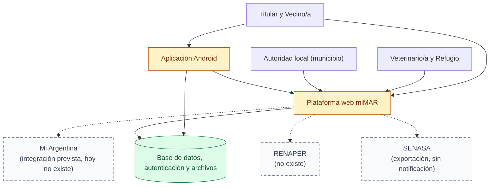

# 01 — Contexto del sistema (reducción ejecutiva)

> Snapshot: `c10f4ff03` (`main`) · Facts: `docs/architecture/facts.json` generated 2026-09-02
> Verified against code on 2026-09-02 by writer A (opus subagent) · Status: reviewed
> Numbers in this file are `<!-- fact:key -->` markers checked by `__tests__/architecture-facts.test.ts`.

## Título

Quién usa miMAR y con qué sistemas habla

## Mensaje clave

miMAR funciona hoy de punta a punta con lo que se ve en el dibujo: la
integración con Mi Argentina está prevista y no existe todavía, y ninguna
verificación de identidad contra un registro nacional forma parte del sistema.

## Nivel

`ejecutivo`. Es la reducción del diagrama técnico de contexto (C4 nivel 1) a
nueve nodos. La versión completa —con almacenamiento, geocodificación, envío de
notificaciones, reporte de fallas y la topología de despliegue— vive en
`docs/architecture/system-context.md` y es material de respaldo, no una lámina.

## Entidades y relaciones

| nodo | etiqueta es-AR | path que lo prueba |
|---|---|---|
| `ciudadania` | Titular y Vecino/a | `app/(app)`, `app/(public)` |
| `profesionales` | Veterinario/a y Refugio | `app/org/[orgToken]/layout.tsx` |
| `estado` | Autoridad local (municipio) | `app/gob/layout.tsx` |
| `web` | Plataforma web miMAR | `app/layout.tsx` |
| `celular` | Aplicación Android | `apps/mobile/app.config.ts` |
| `datos` | Base de datos, autenticación y archivos | `db/schema.ts` |
| `miarg` | Mi Argentina (integración prevista, hoy no existe) | `lib/infra/miarg-oidc.ts` |
| `renaper` | RENAPER (no existe) | `docs/architecture/system-context.md` |
| `senasa` | SENASA (exportación, sin notificación) | `lib/analytics/senasa-export.ts` |

Aristas: `ciudadania`, `profesionales` y `estado` entran a `web`; `ciudadania`
entra además a `celular`; `celular` habla con `web` y con `datos`; `web` habla
con `datos`. Las tres aristas hacia `miarg`, `renaper` y `senasa` son punteadas.

## Mermaid

## Leyenda

- **Verde** — fuente de verdad. Acá: la base de datos con el historial que solo
  se agrega.
- **Ámbar** — superficie derivada: la web y el celular muestran, no guardan la
  verdad.
- **Gris punteado (rayado)** — no existe hoy. Mi Argentina es un conector
  cerrado por configuración; RENAPER no tiene una sola línea de código; de
  SENASA hay exportación y ninguna notificación de vuelta.
- Las flechas punteadas hacia los tres nodos rayados marcan el mismo estado: es
  camino previsto, no capacidad instalada.

## NO dibujar / NO afirmar

- **No dibujar Mi Argentina como una flecha llena, ni decir "estamos
  federados".** El conector devuelve 404 mientras faltan sus cuatro variables de
  entorno (`lib/infra/miarg-oidc.ts:34-37`, `app/auth/miarg/callback/route.ts`).
  La federación es la premisa de diseño (invariante 6 de `CLAUDE.md`), no una
  función entregada.
- **No decir "identidad verificada".** El DNI se declara y se guarda hasheado
  con los últimos cuatro dígitos (`lib/utils/dni-hash.ts`); no hay consulta a
  ningún registro nacional. Fuente: `docs/architecture/privacy-known-limitations.md`.
- **No decir que se notifica a SENASA.** Hay exportación
  (`lib/analytics/senasa-export.ts`) y vocabulario sanitario
  (`lib/reference/sanitary-vocab.ts`); no hay canal de aviso ni de respuesta.
- **No agregar un portal de administración a esta lámina.** Existe
  (`app/admin/layout.tsx`) y aparece en la lámina 02; meterlo acá rompe el techo
  de nueve nodos y mezcla una audiencia interna con la del municipio.
- **No presentar el sistema como auditado completo.** Corrieron 15 de 36 lentes
  en la revisión 2026-09 (`docs/reviews/2026-09-fresh/DECK-FACTS.md`); ninguna
  afirmación cubre un área que no miró nadie.

## Confianza

- **Generado (marcadores).** Esta lámina no usa números del repositorio; no hay
  marcadores en el texto del dibujo. Los conteos van en las láminas 02, 05 y 11.
- **Verificado a mano (path + línea).** El cierre por configuración de Mi
  Argentina, en `lib/infra/miarg-oidc.ts:34-37`, leído en `c10f4ff03`. La
  ausencia de RENAPER se verificó por barrido del repositorio: cero módulos,
  cero rutas, cero variables de entorno. La exportación SENASA sin notificación
  se verificó leyendo `lib/analytics/senasa-export.ts` y
  `lib/analytics/senasa-export-query.ts`.
- **Sin verificar.** Nada en esta lámina. La marca interna del sistema (el
  código `DIM` y el formato de token `DIM-XXXX-XXXX`) no aparece en ninguna
  etiqueta del dibujo, por decisión de la serie.
