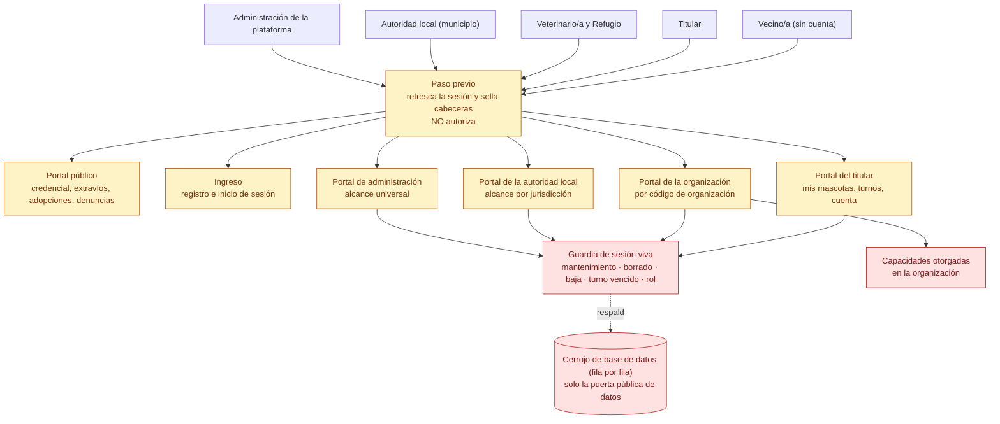

# 02 — Topología de portales: quién entra por dónde

> Snapshot: `c10f4ff03` (`main`) · Facts: `docs/architecture/facts.json` generated 2026-09-02
> Verified against code on 2026-09-02 by writer A (opus subagent) · Status: reviewed
> Numbers in this file are `<!-- fact:key -->` markers checked by `__tests__/architecture-facts.test.ts`.

## Título

Cinco portales, una sola puerta de control por portal

## Mensaje clave

Cada portal decide quién pasa en su propia capa de entrada, antes de que se
dibuje una sola pantalla: el municipio nunca ve el portal de administración y el
vecino nunca necesita una cuenta para leer una credencial.

## Nivel

`técnico`. Existe una reducción ejecutiva posible —cinco cajas de portal y las
personas que entran a cada una, sin la columna de control— pero la lámina
completa es esta, porque el orden de las guardias es exactamente lo que un
funcionario técnico viene a preguntar.

El detalle por ruta y el inventario de páginas están en
`docs/architecture/system-context.md`; acá va la topología.

## Entidades y relaciones

| nodo | etiqueta es-AR | path que lo prueba |
|---|---|---|
| `visitante` | Vecino/a (sin cuenta) | `app/(public)/p/[publicToken]/page.tsx` |
| `titular` | Titular | `app/(app)/layout.tsx` |
| `profesional` | Veterinario/a y Refugio | `app/org/[orgToken]/layout.tsx` |
| `funcionario` | Autoridad local (municipio) | `app/gob/layout.tsx` |
| `administracion` | Administración de la plataforma | `app/admin/layout.tsx` |
| `medio` | Paso previo: refresco de sesión y cabeceras | `lib/supabase/middleware.ts` |
| `publico` | Portal público | `app/(public)/layout.tsx` |
| `ingreso` | Ingreso (registro e inicio de sesión) | `app/(auth)/registro/page.tsx` |
| `portaltitular` | Portal del titular | `app/(app)/layout.tsx` |
| `organizacion` | Portal de la organización | `app/org/[orgToken]/layout.tsx` |
| `gobierno` | Portal de la autoridad local | `app/gob/layout.tsx` |
| `admin` | Portal de administración | `app/admin/layout.tsx` |
| `guardia` | Guardia de sesión viva | `lib/infra/live-user.ts` |
| `capacidades` | Capacidades otorgadas | `db/schema.ts` |
| `cerrojo` | Cerrojo de base de datos (fila por fila) | `docs/architecture/rls-coverage.md` |

**Orden de las guardias, que es el contenido real de la lámina:**

1. El paso previo refresca la cookie de sesión y sella las cabeceras. **No
   autoriza y no pone techo de pedidos** — está dicho así en
   `docs/architecture/api-invariants.md` §0.
2. La capa de entrada de cada portal llama a su guardia: primero el interruptor
   de mantenimiento, después la guardia de sesión viva
   (`lib/infra/live-user.ts:262`), que revisa sesión, borrado, baja, turno
   vencido, rol y tipo de cuenta. Las guardias de portal viven juntas en
   `lib/infra/auth-guards.ts` (líneas 79, 115, 190 y 227).
3. Recién después la pantalla acota su propia lectura: por jurisdicción en
   gobierno, por código de organización en el portal de la organización.
4. El cerrojo de base de datos es respaldo y **solo cubre la puerta pública de
   datos**, nunca la conexión propia del servidor.

Tamaño del árbol: <!-- fact:pages -->262<!-- /fact --> páginas,
<!-- fact:route_handlers -->82<!-- /fact --> manejadores de ruta y apenas
<!-- fact:layouts -->10<!-- /fact --> capas de entrada. Esa proporción es el
argumento: el control está concentrado en las capas de entrada, no repartido
entre las páginas que protege.

## Mermaid

## Leyenda

- **Rojo** — control de seguridad: la guardia de sesión viva, las capacidades
  otorgadas y el cerrojo de base de datos.
- **Ámbar** — superficie derivada: cada portal muestra datos, no los custodia.
- **Sin color / neutro** — las personas.
- **Flecha punteada** — respaldo, no camino principal: el cerrojo actúa sobre la
  puerta pública de datos y no sobre la conexión del servidor.
- El paso previo se dibuja en la columna de superficie y no en la de control **a
  propósito**: parece un control y no lo es.

## NO dibujar / NO afirmar

- **No dibujar el paso previo como un guardia.** Refresca la cookie y pone
  cabeceras; no autoriza ni pone techo de pedidos
  (`docs/architecture/api-invariants.md` §0). Pintarlo de rojo sería el error
  exacto que ese documento existe para evitar.
- **No decir "el cerrojo de base de datos nos protege".** La conexión propia del
  servidor pasa por encima del cerrojo por diseño, y hay
  <!-- fact:service_role_call_sites -->34<!-- /fact --> lugares del código que
  usan la llave de servicio, cada uno saltando el cerrojo a propósito
  (`docs/architecture/rls-coverage.md`).
- **No afirmar que una baja de cuenta cierra todas las puertas.** El rechazo por
  baja está condicionado al tipo de cuenta institucional, así que una cuenta
  personal dada de baja por sí misma no queda bloqueada en ningún borde. Es el
  hallazgo `A01-1`, abierto a esta fecha
  (`docs/reviews/2026-09-fresh/SYNTHESIS.md`).
- **No mostrar el portal de administración como accesible por el municipio.** La
  guardia de `app/admin/layout.tsx` es solo para administración; gobierno se
  redirige a la raíz.
- **No prometer alcance universal para el municipio.** Gobierno ve su
  jurisdicción; casos de otro barrio o de otra provincia quedan fuera de la
  respuesta (`lib/infra/gob-pet-subview.ts`).

## Confianza

- **Generado (marcadores).** `pages`, `route_handlers`, `layouts` y
  `service_role_call_sites` salen de `docs/architecture/facts.json`, regenerado
  por `scripts/architecture-facts.ts` y comparado contra el árbol por
  `__tests__/architecture-facts.test.ts`.
- **Verificado a mano (path + línea).** Las cuatro guardias de portal en
  `lib/infra/auth-guards.ts:79`, `:115`, `:190` y `:227`; la guardia de sesión
  viva en `lib/infra/live-user.ts:262`; el interruptor de mantenimiento en
  `lib/infra/live-user.ts:241`. Los cinco grupos de ruta se leyeron del árbol en
  `c10f4ff03`.
- **Sin verificar.** El comportamiento del cerrojo en la base de datos que está
  corriendo: el número de tablas con cerrojo declarado
  (<!-- fact:rls_enabled_tables -->55<!-- /fact -->) se cuenta sobre el código
  SQL del repositorio, no sobre el catálogo vivo. La única autoridad sobre lo
  que está realmente activo son las pruebas de `__tests__/rls`, que no corrieron
  para armar esta lámina.
