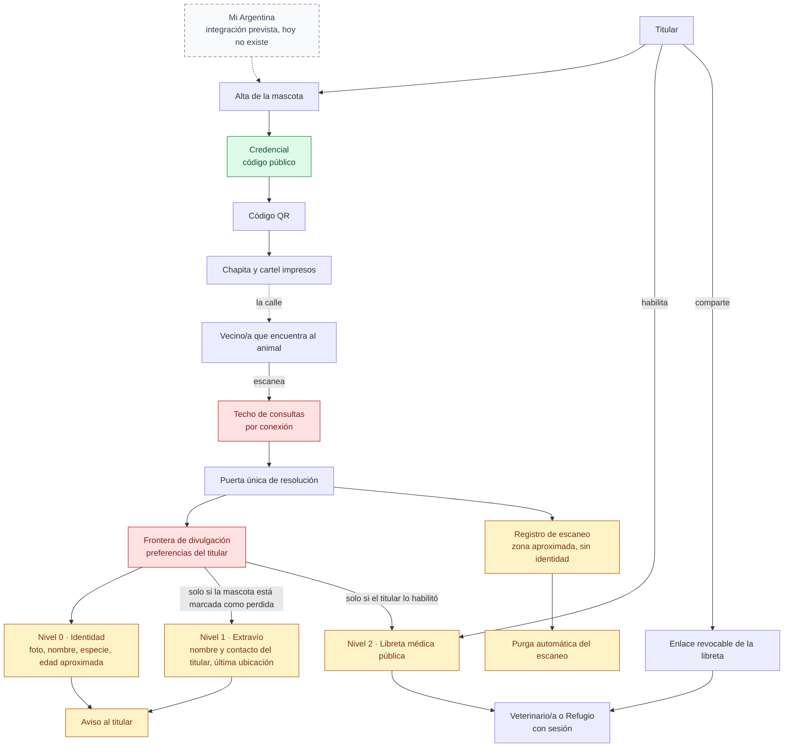

# 03 — Ciclo de la credencial

> Snapshot: `c10f4ff03` (`main`) · Facts: `docs/architecture/facts.json` generated 2026-09-02
> Verified against code on 2026-09-02 by writer B (opus subagent) · Status: reviewed
> Numbers in this file are `<!-- fact:key -->` markers checked by `__tests__/architecture-facts.test.ts`.

## Título

De la mascota a la credencial: qué ve realmente un vecino que escanea el código

## Mensaje clave

La mascota **es** la credencial: un código público resuelve a una página pública, y lo que esa página muestra lo decide el titular campo por campo, no quien escanea.

## Nivel

**Ejecutivo.** Es el recorrido completo de una credencial en una sola lámina, sin nombres de archivo ni de tabla.

Reducción técnica disponible: la misma cadena con los nombres de los módulos y el orden de las verificaciones está en `docs/architecture/public-credential.md` §3 y §4. Si la audiencia pide "¿cómo lo garantizan?", esa es la lámina que sigue, no una versión más densa de ésta.

## Entidades y relaciones

| nodo | etiqueta es-AR | path que lo prueba |
|---|---|---|
| `titular` | Titular | `app/(app)/mis-mascotas/nueva/[publicToken]/credencial/page.tsx` |
| `alta` | Alta de la mascota | `app/(app)/mis-mascotas/nueva/[publicToken]/credencial/page.tsx:42` |
| `miarg` | Mi Argentina (integración prevista, hoy no existe) | `lib/infra/miarg-oidc.ts` |
| `credencial` | Credencial (código público) | `lib/infra/publicToken.ts:58` |
| `qr` | Código QR | `components/ui/CredentialQr.tsx:111` |
| `chapa` | Chapita y cartel impresos | `app/(app)/mis-mascotas/[publicToken]/chapita/page.tsx:64` |
| `vecino` | Vecino/a que encuentra al animal | `docs/onboarding/guia-vecino.md` |
| `caudal` | Techo de consultas | `lib/infra/public-token-throttle.ts:158` |
| `puerta` | Puerta única de resolución | `src/modules/pets/application/read/lookup-public-credential.ts:132` |
| `nivel0` | Nivel 0 · Identidad | `app/(public)/p/[publicToken]/page.tsx:659` |
| `frontera` | Frontera de divulgación (preferencias del titular) | `src/modules/pets/application/read/load-public-credential.ts:223` |
| `nivel1` | Nivel 1 · Extravío | `components/pet-profile/PublicLostSections.tsx` |
| `aviso` | Aviso al titular | `src/modules/pets/application/public/notify-owner-of-found-pet.ts:65` |
| `escaneo` | Registro de escaneo | `src/modules/pets/application/scans/log-scan.ts:86` |
| `purga` | Purga automática del escaneo | `lib/infra/scan-retention.ts:43` |
| `profesional` | Veterinario/a o Refugio con sesión | `app/org/[orgToken]/atender/[publicToken]/page.tsx:36` |
| `nivel2` | Nivel 2 · Libreta médica pública (el titular la habilita) | `src/modules/pets/application/tier2-public/enable-tier2-public.ts:18` |
| `enlace` | Enlace revocable de la libreta | `app/libreta/compartir/[shareToken]/page.tsx` |

## Mermaid

## Leyenda

- **Verde — fuente de verdad.** El código público: se escribe una vez y no se edita. El registro del escaneo **no** va en verde — se purga a los noventa días, y por eso es ámbar acá y en la lámina 04.
- **Rojo — control.** Dos nodos, y son los dos que un funcionario debe poder señalar: el techo de consultas y la frontera de divulgación. Todo lo que un extraño ve pasa por el segundo.
- **Ámbar — vista derivada.** Los tres niveles y el aviso no son datos guardados: son lo que el sistema decide mostrar cada vez, a partir de la ficha y de las preferencias del titular.
- **Gris — sistema externo.** Ninguno en esta lámina. La clase está declarada porque el juego de colores es el mismo en las doce; si aparece un sistema de terceros, va gris.
- **Rayado — no existe hoy.** Mi Argentina.
- **Sin color — persona o pieza de mecanismo.** Titular, vecino/a y profesional son personas, no componentes; el alta, el QR, la impresión, la puerta de resolución y el enlace son piezas que corren, no lugares donde vive un dato ni decisiones de política.

## NO dibujar / NO afirmar

- **No dibujar una flecha de Mi Argentina que funcione.** El nodo va rayado y desconectado con línea punteada. `lib/infra/miarg-oidc.ts` lanza "not implemented" y ninguna cuenta tiene identidad federada hoy (`docs/reviews/2026-09-fresh/DECK-FACTS.md` §4).
- **No afirmar que el veterinario "escanea y ve el historial".** Es la expectativa que el modelo de niveles desmiente: escanear da Nivel 0. El profesional llega al historial porque el titular lo comparte (enlace revocable o Nivel 2), o firma eventos en `app/org/[orgToken]/atender/[publicToken]/page.tsx`, superficie que expone identidad de la mascota y captura clínica y **ningún dato del titular**. La contradicción está registrada en `docs/onboarding/README.md` (Contradicciones, punto 4).
- **No afirmar que el techo de consultas protege datos.** No es una frontera de autorización: quien tiene el código ya puede ver lo que hay. `lib/infra/public-token-throttle.ts:44-47` lo dice en el código, y además el techo **falla abierto** — si la base falla, la página se sirve igual, a propósito, porque es la página de la que depende alguien parado al lado de un animal.
- **No afirmar que el registro de escaneos es permanente.** Se purga; ver `lib/infra/scan-retention.ts:43`. Ese borrado es lo único que acota la retención de toda ubicación en el producto: los campos de ubicación viven solo en esas filas.
- **No afirmar que el escaneo identifica a quien escanea.** Las filas de escaneo llevan el usuario en nulo aun cuando el visitante tenga sesión (`src/modules/pets/application/scans/log-scan.ts:7-27`). La IP nunca entra al registro: se guarda una zona aproximada.
- **No afirmar que todos los campos del Nivel 1 se filtran en la base.** Teléfono y ubicación sí (el sistema ni siquiera los lee cuando el titular no los habilitó); el nombre para mostrar se lee siempre y se recorta al derivar. Lo registra `docs/reviews/2026-09-fresh/lenses/A03.md` (Nits) y **ninguna prueba fija hoy esa parte**.
- **No decir "DIM" en ninguna etiqueta.** La marca en pantalla es miMAR; el prefijo del código es interno.
- **No dibujar la credencial funcionando sin conexión.** El código QR se dibuja en el dispositivo, pero la página no carga offline (`components/ui/CredentialQr.tsx:12-15`).

## Confianza

**Generado (marcador, verificado por la prueba de hechos):** el techo de consultas es de <!-- fact:throttle_per_min -->600<!-- /fact --> por minuto y <!-- fact:throttle_per_hour -->6000<!-- /fact --> por hora, por conexión y por superficie; los prefijos de código público redactados en telemetría son <!-- fact:token_prefixes -->12<!-- /fact -->.

**Verificado a mano (archivo + línea, leído en `c10f4ff03`):**

- El techo corre **antes** de tocar cualquier dato de la mascota — `src/modules/pets/application/read/lookup-public-credential.ts:166-173`, y hay una prueba que recorre el repositorio verificando ese orden en toda superficie que resuelva un código (`__tests__/public-token-throttle-coverage.test.ts`).
- La puerta responde cuatro resultados y nunca confunde "base caída" con "no existe" — `src/modules/pets/application/read/lookup-public-credential.ts:93`.
- Teléfono y ubicación se proyectan como nulo en la consulta cuando el titular no los habilitó — `src/modules/pets/application/read/load-public-credential.ts:237` y `:281-282`.
- La unión con la titularidad está fijada a `role='owner'`, para que el consentimiento del titular no publique el teléfono de un cuidador — `src/modules/pets/application/read/load-public-credential.ts:259-267`.
- El chip que dice "NIVEL 0 · IDENTIDAD" o "NIVEL 2 · DATOS MÉDICOS" es literal en el código — `app/(public)/p/[publicToken]/page.tsx:659`.
- La chapita y el cartel arman la URL absoluta del QR desde `lib/infra/site-url.ts:45`, que nunca devuelve un origen vacío.

**Sin verificar (decirlo si preguntan):**

- Cuánto tarda un escaneo real en la calle sobre red móvil. No se midió en esta auditoría.
- Qué hace exactamente una caché compartida con `/t/{serial}` de una chapita revocada: el hallazgo A03-1 lo marca como abierto (`docs/reviews/2026-09-fresh/lenses/A03.md`).
- La lectura del profesional en el mostrador se leyó en su encabezado y su resolución de acceso, no línea por línea.
