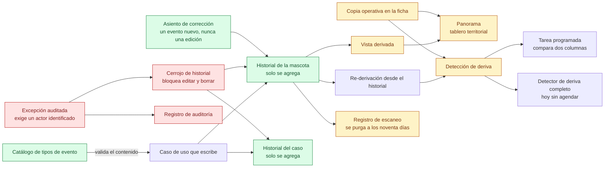

# 04 — Espina de eventos y copias operativas

> Snapshot: `c10f4ff03` (`main`) · Facts: `docs/architecture/facts.json` generated 2026-09-02
> Verified against code on 2026-09-02 by writer B (opus subagent) · Status: reviewed
> Numbers in this file are `<!-- fact:key -->` markers checked by `__tests__/architecture-facts.test.ts`.

## Título

Qué se guarda una sola vez y qué se vuelve a calcular: la espina de eventos y las copias que se declaran como tales

## Mensaje clave

Los hechos sanitarios y de custodia se escriben una vez en un historial que la base de datos no deja editar ni borrar; todo lo que un tablero muestra se vuelve a calcular desde ahí, y las copias que existen por rendimiento están declaradas, comparadas contra el historial y auditadas.

## Nivel

**Técnico.** Es el ejemplo trabajado del plan: la lámina que responde "¿los datos pueden alterarse?" con el mecanismo y no con un adjetivo.

Reducción ejecutiva: si la audiencia no es técnica, mostrar solo la mitad izquierda — caso de uso → historial → cerrojo de historial → excepción auditada — y decir la frase de "Mensaje clave" sin nombrar tablas. La mitad derecha (copias, deriva, tarea programada) es la que sostiene la honestidad, pero solo la piden quienes ya preguntaron por la izquierda.

## Entidades y relaciones

| nodo | etiqueta es-AR | path que lo prueba |
|---|---|---|
| `caso` | Caso de uso que escribe | `src/modules/events/application/lifecycle/set-pet-lost-use-case.ts:106` |
| `catalogo` | Catálogo de tipos de evento | `packages/contract/src/events/event-types.ts:20` |
| `petEvents` | Historial de la mascota | `db/schema.ts:1282` |
| `caseEvents` | Historial del caso | `db/schema.ts:4276` |
| `cerrojo` | Cerrojo de historial: bloquea editar y borrar | `db/migrations/0127_pet_events_append_only.sql:96` |
| `excepcion` | Excepción auditada: exige un actor identificado | `db/migrations/0127_pet_events_append_only.sql:45` |
| `auditoria` | Registro de auditoría | `db/migrations/0127_pet_events_append_only.sql:50` |
| `correccion` | Asiento de corrección | `lib/infra/amendment.ts` |
| `proyeccion` | Vista derivada | `lib/projections/pet-status.ts` |
| `copia` | Copia operativa en la ficha | `lib/infra/rederive-pet-cache.ts:137` |
| `rederivar` | Re-derivación desde el historial | `lib/infra/rederive-pet-cache.ts:326` |
| `deriva` | Detección de deriva | `lib/infra/rederive-pet-cache.ts:482` |
| `tarea` | Tarea programada de reconciliación (dos columnas) | `app/api/cron/reconcile-pet-status/route.ts:64` |
| `detector` | Detector de deriva completo, hoy sin agendar | `scripts/detect-pet-cache-drift.ts:102` |
| `escaneos` | Registro de escaneo: se purga | `db/migrations/0104_scan_events_retention.sql:74` |
| `tablero` | Panorama (tablero territorial) | `src/modules/panorama/infrastructure/repository-choropleth.ts` |

## Mermaid

## Leyenda

- **Verde — fuente de verdad.** Los dos historiales, el catálogo que valida lo que entra, y la corrección, que es un evento más y no una edición.
- **Rojo — control.** El cerrojo de historial, la excepción que exige un actor, y el registro de auditoría que esa excepción escribe. Son tres nodos y forman una sola respuesta: la espina no se edita, y si alguien la edita queda su nombre.
- **Ámbar — derivado.** Vistas derivadas, copias operativas, el Panorama, el reporte de deriva y el registro de escaneo. Nada de esto es la verdad: es lo que se calcula o se guarda por conveniencia, y el diagrama lo pinta distinto a propósito.
- **Gris — sistema externo.** Ninguno en esta lámina: la espina de eventos no habla con nadie afuera. La clase está declarada porque el juego de colores es el mismo en las doce.
- **Rayado — no existe hoy.** Ningún nodo de esta lámina. Si alguien agrega uno, va rayado.
- **Sin color — pieza de mecanismo.** El caso de uso, la re-derivación y los dos detectores: piezas que corren, no lugares donde vive un dato.

Una flecha entrando a un nodo verde significa "escribe una fila nueva". No hay ninguna flecha que signifique "modifica una fila".

## NO dibujar / NO afirmar

- **NO decir "imposible de modificar".** Es un cerrojo de historial con una excepción auditada, no una imposibilidad física. La frase correcta es: "solo se agrega, por política, con un cerrojo de historial en la base y una excepción que exige un actor identificado y deja registro". El disparador está en `db/migrations/0127_pet_events_append_only.sql:96-104` y la exigencia del actor en `:45-48`.
- **NO dibujar un almacén de eventos ni un bus de mensajes aparte.** No existe: los eventos son filas en dos tablas de la misma base (`db/schema.ts:1282` y `db/schema.ts:4276`), y no hay cola, ni tópico, ni servicio de eventos. Dibujar un bus haría prometer una arquitectura que no está.
- **NO afirmar que todas las columnas de la ficha se re-derivan.** No es cierto y el propio código enumera las que no: `lib/infra/rederive-pet-cache.ts:24-63` lista las columnas excluidas con su razón — metadatos de adopción curados a mano, banderas de preferencia que no emiten evento, y tres columnas de condiciones permanentes que estuvieron en ninguna de las dos listas hasta 2026-08-12. La franja honesta es: la mayoría se re-deriva, la lista de exclusiones está escrita, y las exclusiones fueron encontradas por auditoría humana y no por una prueba.
- **NO afirmar que la detección de deriva cubre toda la ficha en producción.** La tarea programada compara **dos** columnas (`app/api/cron/reconcile-pet-status/route.ts:64`); el detector que cubre el resto no está agendado en ninguna parte. Es el hallazgo A08-3 de `docs/reviews/2026-09-fresh/lenses/A08.md`, todavía abierto.
- **NO afirmar que el registro de escaneo es permanente.** Se purga, y esa purga es la única cota de retención de toda ubicación del producto (`db/migrations/0104_scan_events_retention.sql:74-94`, ejecutada por `lib/infra/scan-retention.ts:111`). No existe una tabla separada de escaneos: son filas del historial de la mascota.
- **NO citar el tamaño del catálogo de memoria.** Va con marcador; ver Confianza. La cifra estuvo desactualizada en la documentación del proyecto cuatro veces antes de que existiera la prueba que la fija.
- **NO afirmar que ninguna columna del historial es falsificable.** El rol del autor de un evento es hoy falsificable desde la interfaz pública de la base (hallazgo A02-1 de `docs/reviews/2026-09-fresh/SYNTHESIS.md`, en cola como migración 0212): alguien podría escribir un evento que dice llevar firma profesional. Es la segunda de dos puertas de la misma clase; la primera se cerró el 2026-09-02.
- **NO afirmar que toda re-derivación aplica las correcciones.** La re-derivación central sí (`lib/infra/rederive-pet-cache.ts:326`), pero dos caminos de escritura más chicos vuelven a calcular sobre el historial crudo y pueden revertir un peso o un resultado de preñez ya corregidos — A08-G1 y A08-G2 en `docs/reviews/2026-09-fresh/lenses/A08.md`.
- **NO decir "DIM" en ninguna etiqueta.** La marca en pantalla es miMAR.

## Confianza

**Generado (marcador, verificado por la prueba de hechos):** el catálogo tiene <!-- fact:event_types -->55<!-- /fact --> tipos de evento y las vistas derivadas puras son <!-- fact:projections -->13<!-- /fact --> archivos.

**Verificado a mano (archivo + línea, leído en `c10f4ff03`):**

- El disparador que bloquea edición y borrado del historial de la mascota vive en la cadena de migraciones, no solo en el arranque local: función en `db/migrations/0127_pet_events_append_only.sql:32-94`, disparadores en `:96-104`. El equivalente del historial de casos está en `db/migrations/0121_case_events_append_only.sql:34-68` y `:70-78`.
- La excepción general exige `app.allow_event_mutation` **y** un actor en formato de identificador único; sin el actor la operación se rechaza — `db/migrations/0127_pet_events_append_only.sql:43-64`, rechazo en `:45-48`, fila de auditoría en `:50-61`.
- La excepción es de alcance transaccional en todo el repositorio (no puede quedar pegada a una conexión reutilizada) — verificado por la lente A08 sobre `__tests__/_helpers/db-overrides.ts:85`.
- La fuente de verdad por columna está documentada en línea — `lib/infra/rederive-pet-cache.ts:19-22` — y la lista de columnas comparadas es explícita en `:137-176`.
- La re-derivación pliega las correcciones **una sola vez en el origen**, así que las ocho proyecciones que alimenta heredan el pliegue — `lib/infra/rederive-pet-cache.ts:326`, con prueba y control de no-vacuidad en `__tests__/pet-cache-rederivation.test.ts`.
- Toda mascota tiene su evento de registro, y la verificación es bloqueante y sin línea base tolerada — `scripts/check-spine-integrity.ts`.

**Sin verificar (decirlo si preguntan):**

- Si el disparador está efectivamente instalado en la base viva se comprueba con una consulta al catálogo de Postgres, que esta auditoría **no** corrió: la lente A08 marca ese punto como no probado sobre un despliegue solo-migraciones.
- La paridad entre la versión SQL y la versión TypeScript del plegado de correcciones (`lib/infra/amendment.ts` frente a su gemelo SQL) no se verificó.
- Si el mapa coroplético del Panorama pliega correcciones del tipo de evento que usa para ubicar a la mascota — `src/modules/panorama/infrastructure/repository-choropleth.ts` — quedó sin leer.
- La fila de auditoría de la excepción **no guarda el valor anterior**, así que una edición auditada no es reconstruible (A08-2, abierto). Decirlo antes de que lo pregunten es mejor que después.
