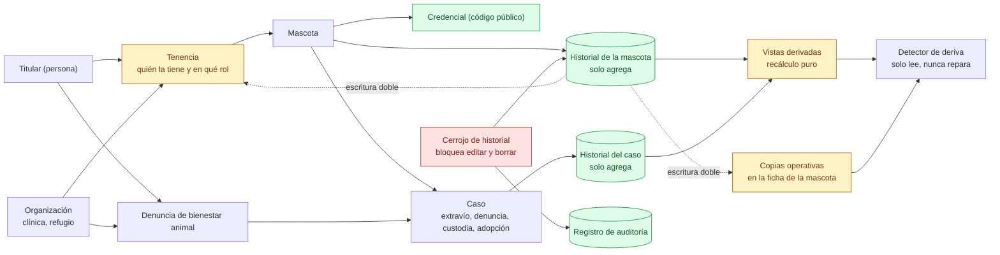

# 05 — Modelo de datos: qué es el registro y qué es una copia

> Snapshot: `c10f4ff03` (`main`) · Facts: `docs/architecture/facts.json` generated 2026-09-02
> Verified against code on 2026-09-02 by writer A (opus subagent) · Status: reviewed
> Numbers in this file are `<!-- fact:key -->` markers checked by `__tests__/architecture-facts.test.ts`.

## Título

El historial es el registro; todo lo demás es una copia que se declara como tal

## Mensaje clave

Los hechos de la vida de un animal —vacuna, traslado, cambio de tenencia,
fallecimiento— se escriben una sola vez en un historial que solo agrega, y cada
copia que existe para que un tablero responda rápido está declarada en un solo
archivo y comparada contra ese historial por un detector automático.

## Nivel

`ejecutivo` y `técnico` a la vez. La reducción ejecutiva es el bloque de la
izquierda del dibujo (Titular, Mascota, Organización, Caso, Historial): cinco
cajas y las relaciones entre ellas. La mitad derecha —copias operativas, vistas
derivadas, detector de deriva y cerrojo de historial— es la parte técnica, y es la que
sostiene el mensaje clave. Si la lámina se recorta, se recorta la derecha y el
mensaje clave se reemplaza por "el historial es el registro".

## Entidades y relaciones

| nodo | etiqueta es-AR | path que lo prueba |
|---|---|---|
| `titular` | Titular (persona) | `db/schema.ts` |
| `mascota` | Mascota | `db/schema.ts` |
| `credencial` | Credencial (código público) | `app/(public)/p/[publicToken]/page.tsx` |
| `tenencia` | Tenencia: quién tiene la mascota y en qué rol | `db/schema.ts` |
| `organizacion` | Organización (clínica, refugio) | `db/schema.ts` |
| `caso` | Caso (extravío, denuncia, custodia, adopción) | `db/schema.ts` |
| `denuncia` | Denuncia de bienestar animal | `db/schema.ts` |
| `historialmascota` | Historial de la mascota (solo agrega) | `db/schema.ts` |
| `historialcaso` | Historial del caso (solo agrega) | `db/schema.ts` |
| `cerrojohistorial` | Cerrojo de historial: bloquea editar y borrar | `db/migrations/0127_pet_events_append_only.sql` |
| `auditoria` | Registro de auditoría | `db/schema.ts` |
| `copias` | Copias operativas en la ficha de la mascota | `lib/infra/rederive-pet-cache.ts` |
| `vistas` | Vistas derivadas (recálculo puro) | `lib/projections/pet-status.ts` |
| `detector` | Detector de deriva (solo lee, nunca repara) | `scripts/detect-pet-cache-drift.ts` |

Tamaño y vocabulario: <!-- fact:tables -->53<!-- /fact --> tablas sobre
<!-- fact:migrations -->211<!-- /fact --> migraciones, un catálogo de
<!-- fact:event_types -->55<!-- /fact --> tipos de asiento
(`packages/contract/src/events/event-types.ts`),
<!-- fact:projections -->13<!-- /fact --> vistas derivadas puras en
`lib/projections`, y <!-- fact:denuncia_kinds -->9<!-- /fact --> tipos de
denuncia (`src/modules/welfare/domain/types.ts`).

## Mermaid

## Leyenda

- **Verde** — fuente de verdad: el historial de la mascota, el historial del
  caso, el registro de auditoría y la credencial (código público). Se escriben
  una vez.
- **Ámbar** — derivado o copiado: las vistas derivadas se recalculan desde el
  historial; las copias operativas y la tenencia se escriben *además* del
  asiento, en la misma transacción, para que un tablero no tenga que recorrer
  una línea de tiempo por fila.
- **Rojo** — control: el cerrojo de historial, que rechaza editar y borrar.
- **Flecha punteada "escritura doble"** — el punto de la lámina: la copia existe
  por diseño, está declarada, y hay algo que la vigila.
- Sin color: entidades de negocio (Titular, Organización, Mascota, Caso,
  Denuncia), y el detector de deriva, que compara copia contra historial.

## NO dibujar / NO afirmar

- **No decir "es imposible modificar el historial".** Es un cerrojo de historial
  con **una excepción auditada**: quien la use debe declarar en la misma
  sesión el identificador de la persona responsable, y cada uso escribe una fila
  en el registro de auditoría
  (`db/migrations/0127_pet_events_append_only.sql:41-64`). Decirlo así es más
  fuerte, no más débil: hay una puerta, tiene nombre y deja rastro.
- **No decir "todo queda para siempre".** Los asientos de escaneo de credencial
  se purgan pasada la ventana de retención, por una segunda excepción angosta
  del mismo cerrojo de historial (`db/migrations/0127_pet_events_append_only.sql:66-88`,
  `db/migrations/0104_scan_events_retention.sql`).
- **No dibujar una tabla de escaneos.** No existe: el escaneo es un asiento
  dentro del historial de la mascota. Buscar `scanEvents` en `db/schema.ts` no
  devuelve nada.
- **No afirmar que el autor de un asiento no se puede falsificar.** Hoy la
  política de inserción por la puerta pública de datos limita de quién es la
  mascota pero no qué rol declara el autor, así que un titular puede escribir un
  asiento diciendo que lo firmó un organismo — y el historial, que solo agrega,
  lo vuelve permanente. Es el hallazgo `A02-1`, en cola como migración 0212
  (`docs/reviews/2026-09-fresh/SYNTHESIS.md`).
- **No decir que todas las copias se recalculan.** Hay una lista explícita de
  columnas excluidas, con el motivo de cada una
  (`lib/infra/rederive-pet-cache.ts:24-63`): la ficha de adopción curada, las
  preferencias de pantalla, la marca de raza potencialmente peligrosa. Y de los
  cinco roles de tenencia —Titularidad, Co-dueño, Cuidador/a, Tránsito y
  Custodia de refugio— solo se vigila el de Cuidador/a
  (`scripts/detect-pet-cache-drift.ts:30-36`, cuya propia nota de hueco tampoco
  nombra al Co-dueño).
- **No decir que el detector repara.** Es de solo lectura por diseño: un
  desacuerdo puede significar que la copia está mal *o* que al historial le
  falta un asiento, y recalcular en el segundo caso destruiría el único valor
  correcto.

## Confianza

- **Generado (marcadores).** `tables`, `migrations`, `event_types`,
  `projections` y `denuncia_kinds` vienen de `docs/architecture/facts.json`.
- **Verificado a mano (path + línea).** El cerrojo y sus dos excepciones, en
  `db/migrations/0127_pet_events_append_only.sql:41-64`, `:66-88`, `:90-93`, y
  los dos disparadores en `:96-104`. La regla de fuente de verdad por columna,
  en `lib/infra/rederive-pet-cache.ts:19-22`; la lista de exclusiones, en
  `:24-63`; el pliegue de correcciones antes de comparar, en `:326`. El hueco de
  los otros tres roles de tenencia, en `scripts/detect-pet-cache-drift.ts:30-36`.
  Todo leído en `c10f4ff03`.
- **Sin verificar.** Si el cerrojo está efectivamente instalado en la base de
  datos que está corriendo hoy. La migración lo declara y explica por qué antes
  no lo estaba —los disparadores vivían solo en el arranque local, así que un
  despliegue que solo aplica migraciones se quedaba sin ellos
  (`db/migrations/0127_pet_events_append_only.sql:6-19`)— pero comprobarlo
  requiere leer el catálogo de la base, que no se hizo para armar esta lámina.
  El nombre interno del sistema (`DIM`) y el formato de token
  `DIM-XXXX-XXXX` no aparecen en ninguna etiqueta del dibujo.
