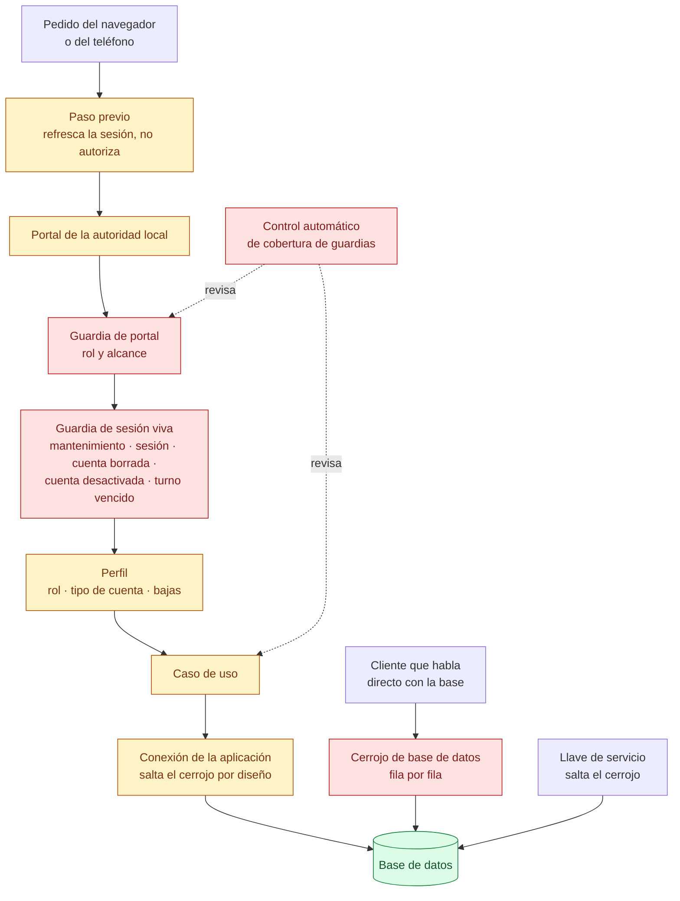

# 06 — Autorización

> Snapshot: `c10f4ff03` (`main`) · Facts: `docs/architecture/facts.json` generated 2026-09-02
> Verified against code on 2026-09-02 by writer C (opus subagent) · Status: reviewed
> Numbers in this file are `<!-- fact:key -->` markers checked by `__tests__/architecture-facts.test.ts`.

## Título

Quién puede hacer qué: dos carriles y un cerrojo de fondo

## Mensaje clave

Toda acción pasa por una única guardia de la aplicación que consulta la base
de datos —nunca el token— para decidir si quien pide todavía puede actuar; y
cuando alguien habla directo con la base, el cerrojo fila por fila es lo único
que lo frena.

## Nivel

`técnico`. Existe una reducción ejecutiva: se dibujan solo los dos carriles y el
cerrojo, sin nombrar archivos ni la llave de servicio.

## Entidades y relaciones

| nodo | etiqueta es-AR | path que lo prueba |
|---|---|---|
| PEDIDO | Pedido del navegador o del teléfono | `packages/contract` |
| BORDE | Paso previo (refresca la sesión, no autoriza) | `middleware.ts` |
| PORTAL | Portal de la autoridad local | `app/gob/layout.tsx` |
| GUARDIA | Guardia de portal (rol y alcance) | `lib/infra/auth-guards.ts` |
| VIVO | Guardia de sesión viva | `lib/infra/live-user.ts` |
| PERFIL | Perfil (rol, tipo de cuenta, bajas) | `lib/infra/request-cache.ts` |
| CASO | Caso de uso | `src/modules` |
| CONEXION | Conexión de la aplicación (salta el cerrojo por diseño) | `db/index.ts` |
| BASE | Base de datos | `db/schema.ts` |
| DIRECTO | Cliente que habla directo con la base | `supabase/config.toml` |
| CERROJO | Cerrojo de base de datos (fila por fila) | `db/rls.sql` |
| LLAVE | Llave de servicio (salta el cerrojo) | `lib/supabase/admin.ts` |
| FENCE | Control automático de cobertura de guardias | `scripts/check-authz-guards.ts` |

## Mermaid

## Leyenda

- **Rojo (control)**: control de seguridad. La guardia de sesión viva, la guardia
  de portal, el cerrojo de base de datos y el control automático que verifica que
  ninguna acción quede sin guardia.
- **Verde (fuente de verdad)**: la base de datos. Todo lo demás pregunta acá.
- **Ámbar (derivado)**: pantallas, perfiles cacheados por pedido y casos de uso
  —cosas que se calculan a partir de la verdad, no la reemplazan.
- **Gris (externo)**: sistema externo. Ninguno en esta lámina; la clase está
  declarada porque el juego de colores es el mismo en las doce.
- **Sin color**: el pedido entrante, el cliente que habla directo con la base y
  la llave de servicio — no son sistemas de terceros ni controles.
- **Línea punteada**: no es tráfico, es verificación automática en cada
  integración.

## NO dibujar / NO afirmar

- **NO afirmar "es imposible que alguien haga algo que no le corresponde".** El
  carril de la izquierda salta el cerrojo por diseño: para la aplicación, la
  cadena de guardias *es* la autorización. Fuente: `db/index.ts` y
  `docs/architecture/rls-coverage.md` (contrato de dos capas).
- **NO dibujar una flecha de "rol" saliendo del token.** La autoridad se resuelve
  leyendo la base, nunca una credencial. Lo único que se lee del token es cuándo
  se inició la sesión, para el turno de <!-- fact:operator_shift_hours -->8<!-- /fact -->
  horas. Fuente: `lib/infra/live-user.ts`.
- **NO afirmar que la desactivación de una cuenta corta el acceso en todos los
  casos.** Hoy la negativa por desactivación aplica solo a cuentas
  institucionales; una cuenta personal que se autodesactiva sigue funcionando.
  Hallazgo abierto A01-1 (ALTO), fuente `docs/reviews/2026-09-fresh/lenses/A01.md`.
- **NO afirmar que el cerrojo de base de datos cubre columnas.** Una política que
  fija la FILA no dice nada sobre qué COLUMNAS se pueden escribir; esa fue la
  falla crítica de la auditoría, cerrada en `db/migrations/0211_profiles_lock_postgrest_writes.sql`,
  y la misma forma sigue abierta sobre el historial de la mascota (A02-1, ALTO).
  Fuente: `docs/reviews/2026-09-fresh/SYNTHESIS.md`.
- **NO dibujar Mi Argentina como parte de esta cadena.** Es la premisa
  arquitectónica del proyecto y hoy es un armazón apagado por variables de
  entorno. Fuente: `lib/infra/miarg-oidc.ts` y `docs/onboarding/README.md`.
- **NO poner "DIM" en ninguna etiqueta.** La marca en pantalla es miMAR.

## Confianza

**Generado (marcador con control automático):** las
<!-- fact:operator_shift_hours -->8<!-- /fact --> horas del turno de operador
salen de `lib/infra/operator-shift.ts` vía `docs/architecture/facts.json`.

**Verificado a mano contra el código en esta instantánea:** la cadena
`middleware.ts:114` → `app/gob/layout.tsx:54` → `lib/infra/auth-guards.ts:190`
→ `lib/infra/live-user.ts:262`; el orden de las cinco negativas
(`lib/infra/live-user.ts:263`, `:292`, `:309`, `:324`, `:342`); la conexión que
salta el cerrojo (`db/index.ts`); las listas de guardias reconocidos
(`scripts/check-authz-guards.ts:50`, `:113`, `:149`, `:155`, `:187`).

**No verificado:** el estado real de las políticas en la base que está corriendo.
Nada se ejecutó para armar esta ficha —ni pruebas, ni consultas— así que todo lo
anterior es lectura de código en un commit. La autoridad sobre lo que está
efectivamente activo es `__tests__/rls`, que necesita una base viva y no se
corrió.
