# 07 — Privacidad

> Snapshot: `c10f4ff03` (`main`) · Facts: `docs/architecture/facts.json` generated 2026-09-02
> Verified against code on 2026-09-02 by writer C (opus subagent) · Status: reviewed
> Numbers in this file are `<!-- fact:key -->` markers checked by `__tests__/architecture-facts.test.ts`.

## Título

Privacidad por diseño y sus límites declarados

## Mensaje clave

El dato personal está protegido por mecanismos concretos —el documento nunca se
guarda en claro, los archivos se sirven con enlaces firmados y de vida corta, y
ningún agregado sale por debajo del umbral de anonimato— y cada lugar donde ese
diseño no alcanza está escrito en un registro público del proyecto, no
descubierto por quien pregunte.

## Nivel

`técnico`. La reducción ejecutiva conserva tres nodos —documento, umbral de
anonimato, derechos del titular— y el recuadro de límites declarados.

## Entidades y relaciones

| nodo | etiqueta es-AR | path que lo prueba |
|---|---|---|
| DOC | Documento que declara la persona | `packages/contract` |
| HMAC | Huella criptográfica del documento (con pimienta) | `lib/utils/dni-hash.ts` |
| PERFIL | Perfil: solo huella y últimos cuatro dígitos | `db/schema.ts` |
| RENAPER | RENAPER (no existe) | `docs/onboarding/README.md` |
| ARCHIVO | Adjunto o foto | `lib/media/validate.ts` |
| BUCKET | Depósito privado | `db/migrations/0206_uploads_staging_bucket.sql` |
| FIRMA | Enlace firmado de vida corta | `lib/infra/storage.ts` |
| CARGA | Carga firmada (ticket de subida) | `lib/infra/pet-photo-upload.ts` |
| AGREG | Agregado por localidad | `lib/metrics/types.ts` |
| UMBRAL | Umbral de anonimato | `lib/metrics/anonymity.ts` |
| ABIERTO | Datos abiertos (con umbral y supresión complementaria) | `lib/open-data/province-suppression.ts` |
| PADRON | Exportación para el organismo (fila por fila, sin umbral) | `app/gob/analytics/export/actions.ts` |
| ART14 | Derecho de acceso (art. 14) | `src/modules/auth/application/subject-rights/export-subject-data.ts` |
| ART16 | Derecho de supresión (art. 16) | `src/modules/auth/application/subject-rights/erase-subject-data.ts` |
| HISTORIAL | Historial de la mascota (solo se agregan asientos) | `db/migrations/0127_pet_events_append_only.sql` |
| REDAC | Redacción antes de reportar un error | `lib/observability/redact.ts` |
| SENTRYWEB | Reporte de errores del navegador (no existe) | `docs/architecture/client-error-sink-pending-decision.md` |
| SENTRYAPP | Reporte de fallas del teléfono (sin filtro propio) | `apps/mobile/src/observability/sentry.ts` |

Los cinco recuadros del dibujo —Identidad, Archivos, Agregados, Derechos del
titular, Errores— son agrupaciones visuales, no entidades: no representan ningún
objeto del sistema y Cowork puede reordenarlos o disolverlos si la lámina lo
pide. Lo que no puede cambiar es el conjunto de nodos y de flechas.

## Mermaid

```mermaid
flowchart TD
  subgraph IDENT["Identidad"]
    DOC["Documento que<br/>declara la persona"] --> HMAC["Huella criptográfica<br/>del documento"]
    HMAC --> PERFIL["Perfil: solo huella y<br/>últimos cuatro dígitos"]
    DOC -.->|"sin verificación contra"| RENAPER["RENAPER<br/>no existe"]
  end

  subgraph ARCH["Archivos"]
    ARCHIVO["Adjunto o foto"] --> CARGA["Carga firmada<br/>ticket de subida"]
    CARGA --> BUCKET["Depósito privado"]
    BUCKET --> FIRMA["Enlace firmado<br/>de vida corta"]
  end

  subgraph AGR["Agregados"]
    AGREG["Agregado por localidad"] --> UMBRAL["Umbral de anonimato"]
    UMBRAL --> ABIERTO["Datos abiertos<br/>con supresión complementaria"]
    AGREG --> PADRON["Exportación para el organismo<br/>fila por fila, sin umbral"]
  end

  subgraph DER["Derechos del titular"]
    ART14["Derecho de acceso<br/>art. 14"]
    ART16["Derecho de supresión<br/>art. 16"] --> HISTORIAL["Historial de la mascota<br/>solo se agregan asientos"]
  end

  subgraph ERR["Errores"]
    REDAC["Redacción antes<br/>de reportar un error"]
    SENTRYWEB["Reporte de errores<br/>del navegador — no existe"]
    SENTRYAPP["Reporte de fallas del<br/>teléfono — sin filtro propio"]
  end

  class HMAC control
  class UMBRAL control
  class FIRMA control
  class CARGA control
  class REDAC control
  class ART14 control
  class ART16 control
  class PERFIL truth
  class HISTORIAL truth
  class AGREG derived
  class ABIERTO derived
  class PADRON derived
  class BUCKET derived
  class RENAPER stub
  class SENTRYWEB stub

  classDef truth fill:#dcfce7,stroke:#15803d,color:#14532d;
  classDef control fill:#fee2e2,stroke:#b91c1c,color:#7f1d1d;
  classDef derived fill:#fef3c7,stroke:#b45309,color:#78350f;
  classDef external fill:#e5e7eb,stroke:#4b5563,color:#1f2937;
  classDef stub fill:#f9fafb,stroke:#6b7280,color:#374151,stroke-dasharray:6 4;
```

## Leyenda

- **Rojo (control)**: los mecanismos que actúan sobre el dato —huella del
  documento, umbral de anonimato, firma de enlaces, redacción de errores, y las
  dos puertas de los derechos del titular.
- **Verde (fuente de verdad)**: lo que queda guardado —el perfil sin documento en
  claro, y el historial de la mascota, al que solo se agregan asientos.
- **Ámbar (derivado)**: las salidas calculadas, y el depósito privado de
  archivos. La exportación para el organismo es ámbar y NO pasa por el umbral:
  es una decisión escrita, no un olvido.
- **Gris (externo)**: sistema externo. Ninguno en esta lámina.
- **Sin color**: el documento y el archivo que aporta una persona, y el reporte de fallas del teléfono, que es módulo propio aunque envíe a un tercero.
- **Contorno punteado (no existe hoy)**: RENAPER y el reporte de errores del
  navegador. No están construidos; el segundo es una decisión abierta.

## NO dibujar / NO afirmar

- **NO afirmar que el documento está verificado.** El documento es
  **autodeclarado**: se guarda como huella criptográfica, nunca en claro, y eso
  prueba que la misma persona escribió el mismo número dos veces —no de quién es
  ese número. No hay verificación contra RENAPER y no hay proveedor elegido.
  Fuente: `lib/utils/dni-hash.ts` y `docs/onboarding/README.md`.
- **NO afirmar que el sistema captura los errores que ve el ciudadano en la web.**
  La web **no tiene** reporte de errores a un tercero: el error muere en la
  pestaña del navegador. La costura técnica está terminada y esperando una
  decisión que es primero legal (transferencia internacional de datos personales,
  Ley 25.326 art. 12) y después de precio. Fuente:
  `docs/architecture/client-error-sink-pending-decision.md`.
- **NO afirmar que el reporte de fallas del teléfono está filtrado.** La
  aplicación móvil sí manda fallas a un tercero y **no tiene gancho de filtrado
  propio**: el redactor del proyecto está cableado solo del lado del servidor.
  Hallazgo A06-2 (MEDIO). Fuente: `apps/mobile/src/observability/sentry.ts`.
- **NO afirmar "ningún dato individual puede reconstruirse".** El registro
  `docs/architecture/privacy-known-limitations.md` declara cuatro entradas con
  etiqueta propia (KA1, KA2, KA5 y PD1), más KA4, que vive dentro de la entrada
  KA1+KA2, aceptados por decisión del responsable de producto:
  - **KA1 y KA2** — la densidad provincial se publica en crudo junto al mapa con
    celdas suprimidas, así que una resta puede recuperar una celda oculta.
  - **KA4** — una ventana angosta en la capa de mortalidad puede aislar una
    muerte individual. No tiene título propio: vive dentro de la entrada
    KA1 + KA2.
  - **KA5** — la lista por prestación de una campaña publica inscripción y
    finalización a precisión completa, mientras la superficie hermana de alcance
    geográfico sí está suprimida; la multiplicación reconstruye lo que la otra
    esconde.
  - **PD1** — la exportación para el organismo sale fila por fila y el umbral de
    anonimato no se le aplica. Medido el 2026-08-22: el 98 % de las celdas de
    mortalidad por localidad está por debajo del umbral, es decir que casi todo
    lo que el tablero oculta se recupera del archivo con una fórmula de planilla.
  - **KA3 no figura en ese registro, con ningún título.** Si alguien lo cita, no
    sale de ahí.
- **NO afirmar que el historial "no se puede modificar".** Solo se agregan
  asientos **por política y por un cerrojo de historial en la base**, con una excepción
  auditada y atribuida a quien la abre. La supresión del art. 16 usa exactamente
  esa excepción para tachar datos personales dentro del asiento, sin borrar la
  fila. Fuente: `db/migrations/0127_pet_events_append_only.sql`.
- **NO dibujar una flecha de "aviso a SENASA".** Existe la exportación; no existe
  la notificación automática al organismo. Fuente:
  `lib/analytics/senasa-export.ts` y `docs/onboarding/README.md`.
- **NO poner "DIM" en ninguna etiqueta.** La marca en pantalla es miMAR.

## Confianza

**Generado (marcadores con control automático):** el umbral de anonimato es
<!-- fact:k_anonymity_k -->5<!-- /fact --> (`lib/metrics/anonymity.ts`); los
enlaces firmados de adjuntos duran
<!-- fact:signed_url_ttl_seconds -->3600<!-- /fact --> segundos
(`lib/infra/storage.ts`); el redactor conoce
<!-- fact:token_prefixes -->12<!-- /fact --> prefijos de códigos del producto
(`lib/observability/redact.ts`).

**Verificado a mano contra el código en esta instantánea:** `hashDni`
(`lib/utils/dni-hash.ts:72`) y `dniLast4` (`:81`); las columnas de huella y
últimos cuatro dígitos (`db/schema.ts:321`, `:322`); la constante del umbral
(`lib/metrics/anonymity.ts:28`) y que no admite ser bajado por quien lo llama
(`:19-26`); las dos puertas de derechos (`app/api/v1/me/privacy/route.ts:97` y
`:175`) y la asimetría deliberada entre ellas (`:214-219`); la inicialización del
reporte de fallas móvil sin gancho de filtrado
(`apps/mobile/src/observability/sentry.ts:41`).

**No verificado / declarado vencido:** la fila de la tabla en
`docs/architecture/client-error-sink-pending-decision.md` que dice que el
teléfono no tiene reporte de fallas quedó vieja —era cierta el 2026-08-29 y ya no
lo es. El resto de ese documento sigue vigente. Además, nada se ejecutó para
armar esta ficha: ni pruebas, ni compilación, ni consultas a la base.
