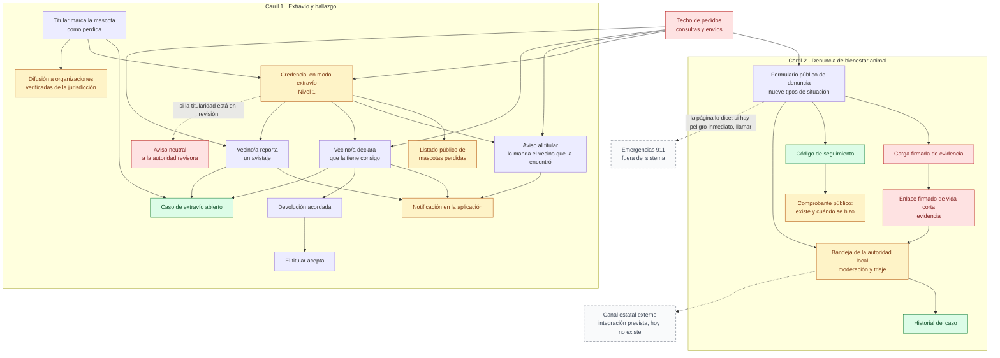

# 08 — Crisis: extravío y denuncias

> Snapshot: `c10f4ff03` (`main`) · Facts: `docs/architecture/facts.json` generated 2026-09-02
> Verified against code on 2026-09-02 by writer B (opus subagent) · Status: reviewed
> Numbers in this file are `<!-- fact:key -->` markers checked by `__tests__/architecture-facts.test.ts`.

## Título

Los dos carriles de crisis: un animal perdido y una denuncia de maltrato

## Mensaje clave

Los dos carriles terminan dentro de miMAR — el de extravío en una devolución acordada entre personas, el de denuncia en la bandeja de la autoridad local — y ninguno de los dos sale hoy hacia un organismo externo.

## Nivel

**Técnico**, por el detalle de los caminos anónimos y de la evidencia.

Reducción ejecutiva: mostrar los dos carriles con cuatro cajas cada uno — quién avisa, dónde entra, quién lo trabaja, cómo termina — y el nodo rayado del canal estatal externo, que es lo que un funcionario necesita ver para saber qué le toca a él. La lámina completa se usa solo si preguntan por los controles.

## Entidades y relaciones

| nodo | etiqueta es-AR | path que lo prueba |
|---|---|---|
| `carril1` | Carril 1 · Extravío y hallazgo | `docs/onboarding/guia-dueno.md` |
| `carril2` | Carril 2 · Denuncia de bienestar animal | `docs/onboarding/guia-vecino.md` |
| `marcar` | Titular marca la mascota como perdida | `src/modules/events/application/lifecycle/set-pet-lost-use-case.ts:106` |
| `casoExtravio` | Caso de extravío abierto | `src/modules/events/application/lifecycle/set-pet-lost-use-case.ts:195` |
| `credencialExtravio` | Credencial en modo extravío (Nivel 1) | `components/pet-profile/PublicLostSections.tsx` |
| `listado` | Listado público de mascotas perdidas | `app/(public)/perdidas/page.tsx` |
| `difusion` | Difusión a organizaciones verificadas | `lib/infra/lost-pet-broadcast.ts:1` |
| `caudal` | Techo de pedidos (consultas y envíos) | `lib/infra/rate-limit.ts` |
| `aviso` | Aviso al titular | `src/modules/pets/application/public/notify-owner-of-found-pet.ts:65` |
| `posesion` | Vecino/a declara que la tiene consigo | `app/(public)/p/[publicToken]/encontre/action.ts:53` |
| `avistaje` | Vecino/a reporta un avistaje | `src/modules/pets/application/sighting/report-pet-sighting.ts` |
| `disputa` | Aviso neutral cuando la titularidad está en revisión | `src/modules/custody-disputes/application/report-dispute-tip.ts` |
| `notificacion` | Notificación en la aplicación | `lib/infra/notification-service.ts:192` |
| `devolucion` | Devolución acordada | `src/modules/return-to-owner/application/propose-return-as-vecino.ts:15` |
| `acepta` | El titular acepta la devolución | `src/modules/return-to-owner/application/owner-accept-return.ts` |
| `formulario` | Formulario público de denuncia (nueve tipos) | `app/(public)/denuncias/nueva/page.tsx` |
| `evidencia` | Carga firmada de evidencia | `lib/infra/welfare-uploads.ts:21` |
| `codigo` | Código de seguimiento | `src/modules/welfare/domain/reference-code.ts:32` |
| `comprobante` | Comprobante público | `app/(public)/denuncias/codigo/[code]/page.tsx` |
| `bandeja` | Bandeja de la autoridad local | `app/gob/denuncias/page.tsx:73` |
| `historialCaso` | Historial del caso | `db/schema.ts:4276` |
| `enlaceFirmado` | Enlace firmado de vida corta | `lib/infra/storage.ts:94` |
| `externo` | Canal estatal externo (integración prevista, hoy no existe) | `app/(public)/denuncias/page.tsx:107` |
| `emergencia` | Emergencias 911 (fuera del sistema) | `app/(public)/ayuda/page.tsx` |

## Mermaid

## Leyenda

- **Verde — fuente de verdad.** El caso de extravío, el historial del caso y el código de seguimiento: se escriben una vez y quedan.
- **Rojo — control.** El techo de pedidos, la carga firmada de evidencia, el enlace firmado de vida corta que la sirve, y el aviso neutral cuando la titularidad está en revisión. Los cuatro son decisiones de seguridad, no de producto.
- **Ámbar — derivado.** La credencial en modo extravío, el listado público, la notificación, el comprobante, la difusión y la bandeja: son lo que el sistema arma para mostrar, no lugares donde vive el hecho.
- **Gris — sistema externo.** Ninguno con línea llena: los dos únicos candidatos, el canal estatal y el 911, van rayados porque no hay integración con ellos.
- **Sin color — acción de una persona.** Marcar, avisar, declarar, proponer, aceptar, completar el formulario.
- **Rayado — no existe hoy.** El canal estatal externo y el 911. El 911 va rayado porque **no es una integración**: es un número que una persona marca, y la propia página lo recomienda. Dibujarlo con línea llena haría creer que miMAR avisa.
- Las flechas punteadas son caminos condicionales o inexistentes; las llenas ocurren siempre.

## NO dibujar / NO afirmar

- **NO dibujar una flecha que llegue a un organismo externo.** La propia página es hoy contradictoria: el mismo aviso legal dice, textual, "Aviso: Las denuncias registradas en este portal son derivadas a las autoridades competentes conforme a la Ley 14.346. La integración con canales gubernamentales está en desarrollo — tu denuncia queda guardada y será enviada cuando esté disponible" (`app/(public)/denuncias/page.tsx:107-111`). La primera oración afirma, en presente, que ya se derivan; la segunda dice que la integración todavía no existe. La gestión real es interna: cola por jurisdicción con respaldo de la administración nacional.
- **NO afirmar que hay notificación automática a SENASA.** El motor de exportación existe; no hay pantalla ni envío automático (`docs/reviews/2026-09-fresh/DECK-FACTS.md` §4).
- **NO afirmar que la policía o el 911 reciben algo.** No hay integración de ninguna clase. Lo único que existe es la recomendación de llamar, en `app/(public)/ayuda/page.tsx`. Esta contradicción ya causó daño y está registrada: una versión anterior de esa página afirmaba sin matiz que "las denuncias son recibidas por las autoridades sanitarias pertinentes", y alguien que ve un animal en peligro podía no llamar creyendo que ya había avisado (`docs/onboarding/README.md`, Contradicciones, punto 3).
- **NO poner "mordedura" entre los tipos de denuncia.** No es uno de ellos: el circuito de mordedura es clínico y organizacional, no de denuncias (`src/modules/welfare/domain/types.ts:12`, y `docs/onboarding/README.md`).
- **NO prometer novedades al denunciante anónimo.** El código de seguimiento confirma que la denuncia **existe** y cuándo se hizo, y nada más: el texto libre, la descripción del denunciado, las coordenadas y la evidencia exigen una sesión verificada contra el correo que quedó en el expediente. Quien denunció sin dejar correo no puede ver el estado nunca (`docs/reviews/2026-09-fresh/DECK-FACTS.md` §3, D05-36).
- **NO dibujar un mapa de mascotas perdidas.** `app/(public)/perdidas/page.tsx` es un listado con filtros, no un mapa. La etiqueta del nodo lo dice por eso. El único punto en un mapa está dentro de la credencial individual, y solo si el titular habilitó la ubicación.
- **NO afirmar que todas las superficies públicas tienen techo de pedidos.** El listado público de mascotas perdidas **no lo tiene** hoy — hallazgo A03-G7 en `docs/reviews/2026-09-fresh/lenses/A03.md`, junto con `/adoptar`, `/adopciones` y `/refugios`. El nodo rojo cubre la credencial, los tres envíos anónimos y el formulario de denuncia; no cubre el listado. Si la lámina dibuja la flecha del techo hacia el listado, miente.
- **NO afirmar que la evidencia sube sin metadatos.** Se limpian los metadatos de los formatos que el servidor puede re-codificar; HEIC, HEIF, GIF y video suben tal cual, y HEIC es el formato por defecto del iPhone, es decir el camino más común de un denunciante (`lib/infra/welfare-uploads.ts:41-60`). Lo que sí es cierto: el comprobante público **no sirve** los archivos que no pueden garantizarse limpios.
- **NO afirmar que el aviso "la encontré" deja rastro en el historial del animal.** No escribe ningún evento ni abre ningún caso: la notificación es todo el circuito (`src/modules/pets/application/public/notify-owner-of-found-pet.ts:23-40`). Los otros dos caminos anónimos sí escriben.
- **NO afirmar que la notificación llega por correo o mensaje de texto.** El servicio tiene una sola pata externa, notificación web cifrada, y está detrás de una bandera apagada por defecto; todo lo demás es dentro de la aplicación (`docs/reviews/2026-09-fresh/DECK-FACTS.md` §4).
- **NO decir "DIM" en ninguna etiqueta.** La marca en pantalla es miMAR; el prefijo del código de denuncia sí se puede leer, es visible para el denunciante.

## Confianza

**Generado (marcador, verificado por la prueba de hechos):** el formulario público ofrece <!-- fact:denuncia_kinds -->9<!-- /fact --> tipos de situación, y los enlaces firmados de evidencia duran <!-- fact:signed_url_ttl_seconds -->3600<!-- /fact --> segundos.

**Verificado a mano (archivo + línea, leído en `c10f4ff03`):**

- Marcar como perdida abre el caso, escribe el evento con la foto de las preferencias de divulgación y actualiza la ficha, todo en una transacción — `src/modules/events/application/lifecycle/set-pet-lost-use-case.ts:193-261`. La difusión ocurre después y es best-effort (`:374-399`).
- La difusión llega a miembros de **organizaciones verificadas cuya cobertura coincide con la jurisdicción**, con cuerpo sin datos personales — `lib/infra/lost-pet-broadcast.ts:1-15`. No es una alerta pública.
- Los tres envíos anónimos están limitados a uno por minuto y diez por hora por par (código, conexión) — `src/modules/pets/application/public/notify-owner-of-found-pet.ts:100`, `app/(public)/p/[publicToken]/encontre/action.ts:162`, y el equivalente en `src/modules/pets/application/sighting/report-pet-sighting.ts`.
- El destinatario del aviso está ordenado: titular primero, después la institución que tiene la custodia, con los cuidadores activos como destinatarios concurrentes — `lib/infra/pet-alert-recipients.ts`, invocado en `src/modules/pets/application/public/notify-owner-of-found-pet.ts:158`.
- Con la titularidad en revisión el aviso se rechaza del lado del servidor y se ofrece el canal neutral — `src/modules/pets/application/public/notify-owner-of-found-pet.ts:140-145`.
- La devolución exige custodia activa, rechaza propuestas superpuestas y toma un cerrojo por mascota dentro de la transacción — `src/modules/return-to-owner/application/propose-return-as-vecino.ts:41-55` y `:96-105`. Una mascota borrada por derecho de supresión responde como un código que nunca existió (`:28-31`).
- La evidencia de denuncias vive en un depósito sin ninguna política pública: se firma desde el servidor y la autorización vive en quien llama — `lib/infra/storage.ts:73-93`. Hasta la migración 0164 el corpus completo era enumerable de forma anónima; eso está cerrado.
- El código de seguimiento usa el mismo alfabeto sin caracteres ambiguos y el mismo muestreo por rechazo que el código de la credencial, pero otra implementación — `src/modules/welfare/domain/reference-code.ts:15` y `:32`.
- La bandeja de la autoridad local unifica moderación y triaje en una pantalla con etapas — `app/gob/denuncias/page.tsx:47-53`.
- El envío de la denuncia gasta su propio presupuesto: cubeta anónima por conexión y cubeta por usuario cuando hay sesión — `src/modules/welfare/actions.ts:831-855`. Es una cubeta distinta de la de la credencial (`lib/infra/public-token-throttle.ts:158`); el nodo rojo de la lámina las agrupa a las dos, y esa agrupación es una simplificación de la lámina, no del código.

**Sin verificar (decirlo si preguntan):**

- **La moderación por jurisdicción del funcionario ya está entregada**, en contra de lo que dice el material de venta vigente (D05-15 en `docs/reviews/2026-09-fresh/DECK-FACTS.md`). Esta lámina la dibuja como existente; la revisión que lo estableció fue de lectura de código, no una prueba de extremo a extremo en un entorno vivo.
- No se midió cuánto tarda la autoridad en tomar una denuncia: no hay dato de operación, solo el mecanismo.
- El techo de envíos anónimos es por par (código, conexión). No existe un tope por código solo, así que con muchas conexiones distintas el volumen crece — hallazgo A03-2, abierto (`docs/reviews/2026-09-fresh/lenses/A03.md`).
- Las citas legales que aparecen en pantalla (Ley 14.346, Ley 25.326) se confirmaron como anclas **en el código**, nunca como correctas o vigentes en derecho. Eso lo tiene que mirar un abogado antes de la presentación.
