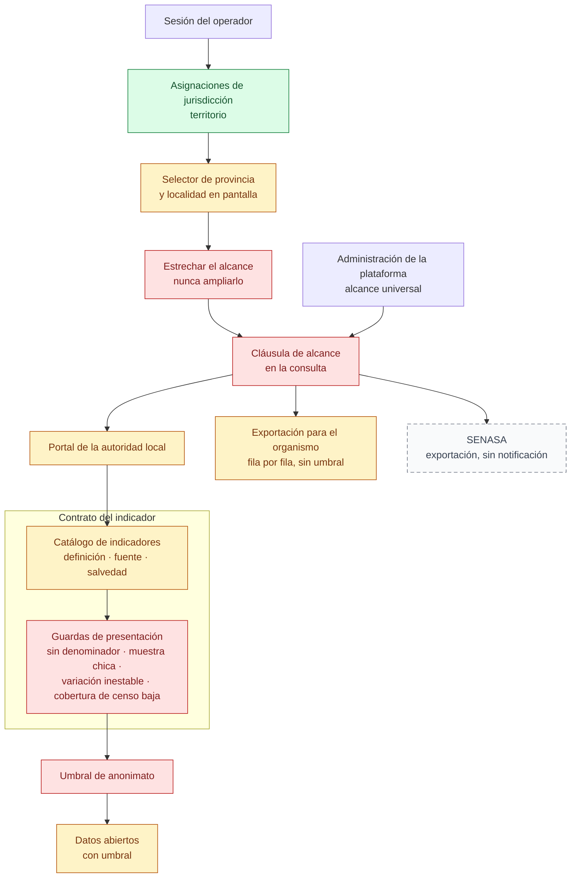

# 09 — Vistas de gobierno

> Snapshot: `c10f4ff03` (`main`) · Facts: `docs/architecture/facts.json` generated 2026-09-02
> Verified against code on 2026-09-02 by writer C (opus subagent) · Status: reviewed
> Numbers in this file are `<!-- fact:key -->` markers checked by `__tests__/architecture-facts.test.ts`.

## Título

Qué ve el municipio: su territorio, nada más

## Mensaje clave

El alcance de un operador sale de sus asignaciones y solo puede achicarse —un
parámetro en la URL nunca agrega territorio— y cada número que ve llega con su
definición, su umbral de anonimato y las reglas que le impiden pintar de rojo
una muestra de dos casos.

## Nivel

`técnico`, con reducción ejecutiva: la fila superior (asignaciones → estrechar →
cláusula → pantalla) más el recuadro de indicadores, sin los carriles de
exportación.

## Entidades y relaciones

| nodo | etiqueta es-AR | path que lo prueba |
|---|---|---|
| SESION | Sesión del operador | `lib/infra/auth-guards.ts` |
| MANDATO | Asignaciones de jurisdicción (territorio) | `db/schema.ts` |
| SELECCION | Selector de provincia y localidad | `lib/analytics/jurisdiction-scope.ts` |
| ESTRECHAR | Estrechar el alcance (nunca ampliarlo) | `lib/domain/jurisdiction-canonical.ts` |
| CLAUSULA | Cláusula de alcance en la consulta | `lib/metrics/scope.ts` |
| PANTALLA | Portal de la autoridad local | `app/gob/layout.tsx` |
| ADMIN | Administración de la plataforma (alcance universal) | `app/admin/layout.tsx` |
| CATALOGO | Catálogo de indicadores (definición, fuente, salvedad) | `lib/metrics/kpi-catalog.ts` |
| GUARDAS | Guardas de presentación (evitan el número deshonesto) | `lib/metrics/presentation-guards.ts` |
| UMBRAL | Umbral de anonimato | `lib/metrics/anonymity.ts` |
| ABIERTO | Datos abiertos (con umbral) | `lib/open-data/province-suppression.ts` |
| PADRON | Exportación para el organismo (fila por fila, sin umbral) | `app/gob/analytics/export/actions.ts` |
| SENASA | SENASA (exportación, sin notificación) | `lib/analytics/senasa-export.ts` |

El recuadro "Contrato del indicador" es una agrupación visual —el inserto de la
lámina— y no una entidad del sistema. Cowork puede moverlo o convertirlo en una
llamada al costado; lo que no puede cambiar es el conjunto de nodos y de flechas.

## Mermaid

## Leyenda

- **Verde (fuente de verdad)**: las asignaciones de jurisdicción. Todo el alcance
  de la pantalla se deriva de ahí y de ningún otro lado. Verde acá señala el
  origen único del alcance, no una tabla de solo agregado.
- **Rojo (control)**: los cuatro puntos donde algo se frena —el estrechamiento,
  la cláusula que baja a la consulta, las guardas de presentación y el umbral de
  anonimato.
- **Ámbar (derivado)**: pantallas, catálogo y salidas calculadas. La exportación
  para el organismo es ámbar y **no** cruza el umbral: es una decisión escrita.
- **Gris (externo)**: sistema externo. Ninguno en esta lámina.
- **Sin color**: la sesión del operador y la administración de la plataforma, cuyo alcance universal es la definición del rol y no una filtración.
- **Contorno punteado (no existe hoy)**: la notificación a SENASA. La exportación
  sí existe; el aviso automático al organismo, no.
- **Recuadro "Contrato del indicador"**: el inserto de la lámina. Cada número
  llega con definición, fuente y salvedad, y con reglas que le impiden mentir.

## NO dibujar / NO afirmar

- **NO afirmar que un funcionario ve el país.** El alcance solo se achica.
  Excepción declarada: la administración de la plataforma tiene alcance
  universal por definición del rol. Fuente:
  `lib/domain/jurisdiction-canonical.ts` y `lib/infra/gov-scope.ts`.
- **NO afirmar que ninguna pantalla puede devolver números nacionales a un
  municipio.** En un resolvedor distinto del de `lib/metrics/scope.ts` —que sí
  falla cerrado (`:109`)— hay un caso abierto en el que una lista de
  jurisdicciones vacía se interpreta como alcance universal en vez de fallar
  cerrada, y un parámetro de provincia fuera del mandato la produce. Hallazgo
  A01-2 (MEDIO), fuente `docs/reviews/2026-09-fresh/lenses/A01.md`.
- **NO afirmar que todas las salidas llevan umbral de anonimato.** Son cuatro
  carriles con posturas distintas: datos abiertos sí (con supresión
  complementaria y cruzada entre conjuntos), campañas a medias (el alcance
  geográfico sí, la lista por prestación no — límite KA5), exportación para el
  organismo no (límite PD1, declarado), y SENASA usa una lista blanca de campos, que es
  otra cosa. Fuente: `docs/architecture/privacy-known-limitations.md`.
- **NO afirmar que la exportación SENASA está homologada.** El formato real de
  intercambio **no se conoce**; lo implementado responde al esquema interno
  alineado y el formateador definitivo entra cuando llegue la especificación.
  Fuente: `lib/analytics/senasa-export.ts`.
- **NO dibujar una notificación automática a la autoridad.** Ni SENASA ni los
  canales estatales de denuncias reciben nada automáticamente; la gestión es
  interna y la propia página pública del flujo lo aclara. Fuente:
  `docs/onboarding/README.md`.
- **NO presentar un semáforo como veredicto legal.** El catálogo separa el
  mandato legal del objetivo programático: la ley obliga a vacunar, el porcentaje
  es una meta de salud pública, y se renderizan como dos hechos distintos.
  Fuente: `lib/metrics/kpi-catalog.ts`.
- **NO afirmar que el número mide la realidad del territorio.** Mide lo que miMAR
  registró. La salvedad está escrita en el propio descriptor del indicador.
- **NO poner "DIM" en ninguna etiqueta.** La marca en pantalla es miMAR.

## Confianza

**Generado (marcadores con control automático):** el catálogo tiene
<!-- fact:kpi_descriptors -->86<!-- /fact --> descriptores de indicadores
(`lib/metrics/kpi-catalog.ts`); el umbral de anonimato es
<!-- fact:k_anonymity_k -->5<!-- /fact --> (`lib/metrics/anonymity.ts`); el
formulario público de denuncias tiene
<!-- fact:denuncia_kinds -->9<!-- /fact --> tipos
(`src/modules/welfare/domain/types.ts`).

**Verificado a mano contra el código en esta instantánea:** la guardia del portal
(`app/gob/layout.tsx:54`); el estrechamiento (`lib/domain/jurisdiction-canonical.ts:226`)
y su delegación desde `lib/infra/gov-scope.ts:65`; la cláusula que falla cerrada
para una lista vacía (`lib/metrics/scope.ts:109`); el catálogo y su lista plana
(`lib/metrics/kpi-catalog.ts:368` y `:2446`); las cuatro guardas de presentación
(`lib/metrics/presentation-guards.ts`); la lista blanca de campos de la
exportación (`lib/analytics/govt-exports.ts:87`) y el asiento de auditoría que
deja cada exportación (`app/gob/analytics/export/actions.ts:279`); las seis
bandas del menú (`components/layout/nav-presets.ts:440`).

**No verificado:** que el alcance del panorama se resuelva de manera uniforme en
sus cinco rutas de datos. No lo hace: dos pasan por el resolvedor compartido y
tres lo reimplementan en línea, y aunque el repositorio vuelve a aplicar la
cláusula del operador en cada consulta, **ninguna prueba ejercita** a un operador
de barrio pidiendo el nivel provincia. Fuente:
`docs/reviews/2026-09-fresh/lenses/A10.md`. Nada se ejecutó para armar esta
ficha.
