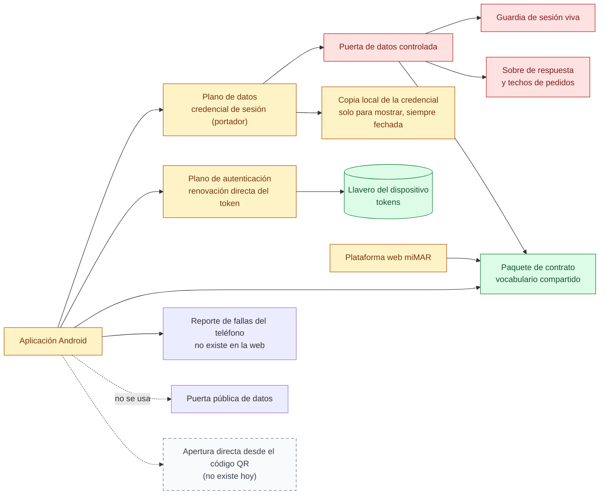

# 10 — Contrato entre el celular y la web

> Snapshot: `c10f4ff03` (`main`) · Facts: `docs/architecture/facts.json` generated 2026-09-02
> Verified against code on 2026-09-02 by writer A (opus subagent) · Status: reviewed
> Numbers in this file are `<!-- fact:key -->` markers checked by `__tests__/architecture-facts.test.ts`.

## Título

Dos planos y un vocabulario compartido

## Mensaje clave

La aplicación no toca la base de datos: pide los datos por la misma puerta
controlada que usa la web, y usa el servicio de autenticación solo para renovar
la sesión — dos caminos separados a propósito, con un único paquete de contrato
que impide que la web y el celular se digan cosas distintas.

## Nivel

`técnico`. La reducción ejecutiva posible son tres cajas —Aplicación, Puerta de
datos, Base de datos— con la leyenda "el celular nunca habla directo con la base
de datos"; se pierde el plano de autenticación, que es justamente lo que hace la
sesión confiable, así que la lámina completa es esta.

Los techos de pedidos y el formato de respuesta no se repiten acá: están en
`docs/architecture/api-invariants.md` y resumidos en
`docs/architecture/mobile-contract.md`.

## Entidades y relaciones

| nodo | etiqueta es-AR | path que lo prueba |
|---|---|---|
| `app` | Aplicación Android | `apps/mobile/app.config.ts` |
| `planodatos` | Plano de datos: pedido con credencial de sesión (portador) | `apps/mobile/src/api/client.ts` |
| `planoauth` | Plano de autenticación: renovación directa del token | `apps/mobile/src/auth/supabase-auth.ts` |
| `llavero` | Llavero del dispositivo: guarda los tokens | `apps/mobile/src/auth/secure-store-auth-storage.ts` |
| `apiv1` | Puerta de datos controlada | `app/api/v1/me/route.ts` |
| `guardia` | Guardia de sesión viva | `lib/infra/live-user.ts` |
| `sobre` | Sobre de respuesta y techos de pedidos | `lib/infra/api-v1.ts` |
| `contrato` | Paquete de contrato: vocabulario compartido | `packages/contract/src/index.ts` |
| `web` | Plataforma web miMAR | `app/layout.tsx` |
| `cachecred` | Copia local de la credencial (solo para mostrar) | `apps/mobile/src/credential/credential-cache.ts` |
| `puertapublica` | Puerta pública de datos: no se usa desde el celular | `docs/architecture/rls-coverage.md` |
| `fallas` | Reporte de fallas del teléfono | `apps/mobile/src/observability/sentry.ts` |
| `applinks` | Apertura directa desde el código QR (no existe hoy) | `docs/architecture/mobile-contract.md` |

El vocabulario compartido incluye los <!-- fact:event_types -->55<!-- /fact -->
tipos de asiento, las formas de cada respuesta, los esquemas de lo que un
cliente puede enviar y la tabla de enlaces. La aplicación se prueba con
<!-- fact:mobile_jest_files -->80<!-- /fact --> archivos de prueba propios.

## Mermaid

## Leyenda

- **Verde** — fuente de verdad: el llavero del dispositivo, que es el único
  lugar donde vive el token de renovación, y el paquete de contrato, que es la
  única definición del vocabulario que comparten la web y el celular. Verde acá
  marca el único lugar donde vive un dato, no la columna vertebral de eventos de
  solo agregado.
- **Rojo** — control: la puerta de datos, la guardia de sesión viva y el sobre
  de respuesta con sus techos de pedidos.
- **Ámbar** — superficie derivada, incluida la copia local de la credencial.
- **Gris** — sistema externo. Ninguno en esta lámina.
- **Sin color** — superficie que existe pero no participa: la puerta pública de
  datos existe y el celular no la usa; el reporte de fallas del teléfono existe
  **solo** en el celular.
- **Gris punteado (rayado)** — no existe hoy: abrir la aplicación directamente
  desde un código QR.

## NO dibujar / NO afirmar

- **No dibujar una flecha llena entre la aplicación y la base de datos.** El
  plano de datos pasa siempre por la puerta controlada. El motivo está escrito
  donde se aplica: casi todas las políticas de la puerta pública derivadas de la
  tenencia no miran el rol, y la inserción en el historial no revisa ni rol ni
  tipo de asiento (`apps/mobile/src/config/api.ts:19-28`).
- **No decir que el código QR abre la aplicación.** Abre el navegador. Hace
  falta publicar la huella del certificado con el que firma la tienda, y esa
  huella no existe antes de la inscripción en la tienda
  (`apps/mobile/app.config.ts`). Un esquema propio no reemplaza eso: ninguna
  cámara de teléfono lo seguiría, y no debería, porque cualquier aplicación pudo
  haberlo reclamado.
- **No mostrar la copia local como si fuera la credencial.** Siempre se muestra
  con su antigüedad y con el aviso de que viene de la copia, y la antigüedad se
  calcula con la fecha que puso el servidor, no con el reloj del teléfono. Sin
  ese aviso alguien podría exhibir una vacuna "vigente" que venció el mes
  pasado.
- **No prometer observabilidad simétrica.** El celular tiene reporte de fallas
  del teléfono; la web **no tiene ninguno** — un error del navegador muere en la
  pestaña. La
  decisión de proveedor está abierta
  (`docs/architecture/client-error-sink-pending-decision.md`).
- **No decir que todo lo que escribe la aplicación es un agregado.** Registrar
  una mascota, asentar un evento y enmendar uno lo son; declarar un extravío,
  compartir una libreta y transferir la titularidad mueven estado y pueden
  cambiar quién es el Titular (`apps/mobile/src/api/endpoints.ts`).
- **No mostrar techos de pedidos como una defensa dura.** Todos los limitadores
  de esta superficie fallan abiertos: si el limitador falla, el pedido pasa
  (`docs/architecture/api-invariants.md` §1.6).

## Confianza

- **Generado (marcadores).** `event_types` y `mobile_jest_files`, de
  `docs/architecture/facts.json`.
- **Verificado a mano (path + línea).** La separación de los dos planos, en
  `apps/mobile/src/config/api.ts:19-28`; las dos constantes separadas, en `:50` y
  `:70-71`; la detección de planos cruzados, en `:116-141`. La política de
  sesión (renovar una vez, reintentar una vez) y los dos niveles del cliente, en
  `apps/mobile/src/api/client.ts:142` y `:238`. El alcance del cliente de
  autenticación, en `apps/mobile/src/auth/supabase-auth.ts:13-18`. El sobre
  obligatorio y su verificación automática, en `lib/infra/api-v1.ts:24-26` y
  `scripts/check-api-v1-envelope.ts`.
- **Sin verificar.** Los techos de pedidos de la superficie autenticada están
  calculados sobre un supuesto de adopción de un producto que todavía no se
  lanzó; el propio módulo lo dice y pide recalcularlo con datos reales
  (`lib/infra/api-v1-limits.ts`, `docs/architecture/api-invariants.md` §1.6). El
  nombre interno del sistema (`DIM`) no aparece en ninguna etiqueta del dibujo.
