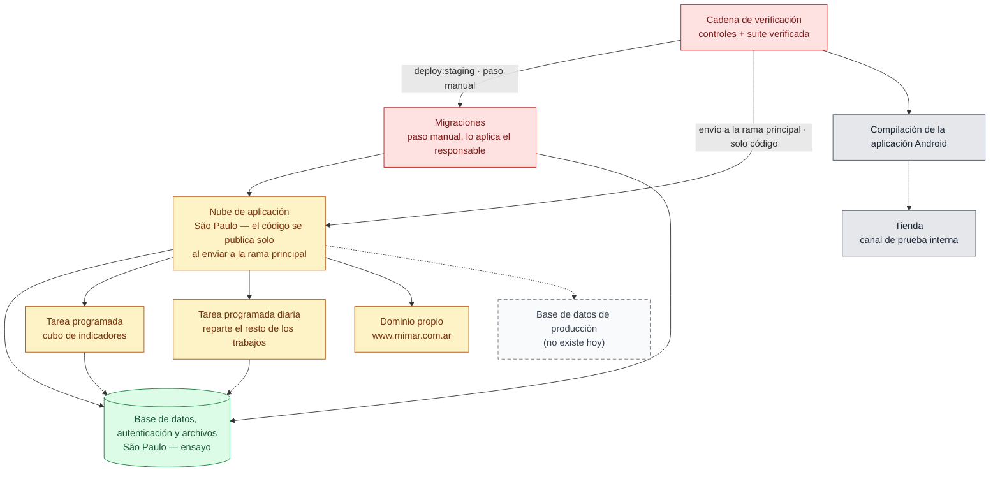

# 11 — Dónde corre y cómo se publica

> Snapshot: `c10f4ff03` (`main`) · Facts: `docs/architecture/facts.json` generated 2026-09-02
> Verified against code on 2026-09-02 by writer A (opus subagent) · Status: draft
> Numbers in this file are `<!-- fact:key -->` markers checked by `__tests__/architecture-facts.test.ts`.

## Título

Dónde corre miMAR hoy, y qué pasa entre un cambio y la calle

## Mensaje clave

La aplicación corre en São Paulo con la base de datos al lado y se publica sola
al enviar un cambio a la rama principal, pero **eso sube código y nada más**: las
migraciones de base de datos son un paso manual aparte que decide una persona, y
hoy existe **una sola** base de datos viva: la de ensayo.

## Nivel

`ejecutivo` con anexo técnico. La reducción ejecutiva son las cuatro cajas de
arriba (Cadena de verificación, Nube de aplicación, Base de datos, Tienda). Las
tareas programadas, el paso de migraciones y el nodo rayado son el anexo, y son
la parte que no conviene omitir frente a un área técnica del municipio.

## Entidades y relaciones

| nodo | etiqueta es-AR | path que lo prueba |
|---|---|---|
| `compuerta` | Cadena de verificación | `.github/workflows/ci.yml` |
| `migraciones` | Migraciones: paso separado, lo aplica el responsable del producto | `scripts/migrate.ts` |
| `nube` | Nube de aplicación (São Paulo) | `docs/ops/staging-deploy.md` |
| `basedatos` | Base de datos, autenticación y archivos (São Paulo) | `docs/ops/cutover-playbook.md` |
| `cronCubo` | Tarea programada: recálculo del cubo de indicadores | `app/api/cron/refresh-cube/route.ts` |
| `cronDiario` | Tarea programada diaria: reparte el resto de los trabajos | `app/api/cron/daily/route.ts` |
| `compilacion` | Compilación de la aplicación Android | `apps/mobile/eas.json` |
| `tienda` | Tienda: canal de prueba interna | `docs/agents/open-work.md` |
| `dominio` | Dominio propio (www.mimar.com.ar) | `docs/ops/cutover-playbook.md` |
| `produccion` | Base de datos de producción (no existe hoy) | `docs/reviews/2026-09-fresh/SYNTHESIS.md` |

**Dos caminos llegan a la nube, y la diferencia es la lámina entera:** el
automático, que dispara un envío a la rama principal y sube **solo código**; y
el manual encadenado `deploy:staging`, que corre las migraciones primero y solo
sube si pasan. Ninguna migración viaja por el primero.

**Lo que hay que poder decir de memoria:**

- La cadena de verificación local es `pnpm verify` —<!-- fact:verify_fences -->67<!-- /fact -->
  controles automáticos— más la suite de <!-- fact:vitest_files -->1490<!-- /fact -->
  archivos de prueba, corrida por un verificador que desconfía del código de
  salida en las dos direcciones (`scripts/run-verified-suite.ts`). En la nube
  hay <!-- fact:ci_workflows -->7<!-- /fact --> flujos de integración continua.
- **El código se publica solo.** Enviar un cambio a la rama principal dispara un
  despliegue de producción por la integración de la nube con el repositorio.
  Verificado el 2026-09-02 contra la interfaz de programación del proveedor: el
  despliegue de producción del commit de esta instantánea declara origen `git`,
  su alias de rama y sus alias de producción. **Las dos guías de operación del
  repositorio dicen lo mismo y están al día** — `docs/ops/staging-deploy.md:31`
  y `docs/ops/production-deploy-plan.md:128-130` declaran el proyecto conectado
  al repositorio, verificado el 2026-09-02 contra la interfaz del proveedor.
- **Ese despliegue automático sube código y nada más: no aplica migraciones.**
  Para eso está la orden encadenada `deploy:staging` en `package.json`
  —verificación, después migraciones, después subida—, que es el camino
  documentado que sí las corre. El encadenado es el control: si la migración
  falla, el código no sube. Aplicar una migración sobre la base remota es un paso
  manual reservado al responsable del producto (`scripts/migrate.ts`).
- Las tareas programadas son <!-- fact:vercel_crons_declared -->2<!-- /fact -->
  en la nube, y la diaria reparte <!-- fact:cron_jobs -->23<!-- /fact --> trabajos
  en orden, aislando la falla de cada uno
  (`lib/infra/cron-dispatcher.ts`). Hay
  <!-- fact:cron_route_dirs -->25<!-- /fact --> carpetas de tarea en el árbol,
  porque el repartidor y el cubo tienen las suyas propias.
- Los recorridos de navegador (<!-- fact:e2e_specs -->45<!-- /fact -->) son un
  control **aparte**, nocturno, y no forman parte de la cadena de verificación
  local (`.github/workflows/e2e-nightly.yml`).
- <!-- fact:migrations -->211<!-- /fact --> migraciones, solo hacia adelante y
  nunca editadas.

## Mermaid

## Leyenda

- **Verde** — fuente de verdad: la base de datos. Hoy es una sola, la de ensayo.
- **Rojo** — control: la cadena de verificación y el paso de migraciones, que es
  el único punto donde una persona decide.
- **Ámbar** — superficie derivada: la nube de aplicación, las tareas programadas
  y el dominio propio, que leen y muestran pero no custodian.
- **Gris** — sistemas externos: la compilación y la tienda.
- **Gris punteado (rayado)** — no existe hoy: una base de datos de producción
  separada. Es el único nodo rayado de esta lámina.
- **Flecha llena hacia el dominio propio** — el dominio está activo y sirve la
  aplicación. **Flecha punteada hacia producción** — camino previsto, no
  capacidad instalada.
- **Dos flechas hacia la nube** — la rotulada "envío a la rama principal · solo
  código" es el despliegue automático; la que pasa por Migraciones, rotulada
  "deploy:staging · paso manual", es el camino que aplica el esquema. Dibujar
  una sola promete que un cambio de esquema llega solo, que es exactamente lo
  que esta lámina existe para desmentir.

## NO dibujar / NO afirmar

- **No decir "cada envío publica todo".** Publica **el código y nada más**. La
  integración con el repositorio no aplica migraciones de base de datos: eso lo
  hace la orden encadenada `deploy:staging` (`package.json`), y aplicarla contra
  la base remota es un paso manual del responsable del producto. Confundir las
  dos cosas es prometer que un cambio de esquema llega solo, que es exactamente
  el incidente con el que abre `docs/ops/staging-deploy.md`: código adelante de
  sus migraciones responde con error en tiempo de ejecución.
- **No decir que hay ambiente de producción.** Hay uno solo, y es el de ensayo:
  "la única base de datos viva (no hay base de datos de producción; el proyecto
  viejo está INACTIVO)" (`docs/reviews/2026-09-fresh/SYNTHESIS.md`). Que el
  dominio propio esté activo no crea un segundo ambiente: apunta al mismo
  despliegue y a la misma base.
- **No decir que la aplicación está publicada en la tienda para el público.** El
  canal es de prueba interna, y la versión publicada anterior **no puede
  iniciar sesión** porque se compiló sin sus variables
  (`docs/agents/open-work.md`).
- **No presentar las tareas programadas como auto-vigiladas.** El control que
  certifica que un trabajo respeta su presupuesto de tiempo compara texto en el
  archivo de la ruta, así que un trabajo que recibe el presupuesto y lo ignora
  pasa igual. Es el hallazgo `C04-1`
  (`docs/reviews/2026-09-fresh/SYNTHESIS.md`).
- **No decir que los recorridos de navegador están en verde.** El trabajo
  nocturno está en rojo por secretos que nunca se crearon, y eso está registrado
  (`docs/agents/open-work.md`).

## Confianza

- **Generado (marcadores).** `verify_fences`, `vitest_files`, `ci_workflows`,
  `e2e_specs`, `migrations`, `vercel_crons_declared`, `cron_jobs` y
  `cron_route_dirs`, todos de `docs/architecture/facts.json`.
- **Verificado a mano (path + línea).** La región de la nube (`gru1`, São Paulo)
  está declarada en `vercel.json`, clave `regions` — es el único dato de región
  que vive en un archivo de configuración del repositorio. Las dos tareas
  programadas y sus horarios, en el mismo archivo. La orden de publicación
  encadenada, en `package.json` (`deploy:staging`). El reparto diario y su
  presupuesto de tiempo, en `lib/infra/cron-dispatcher.ts:473`. Los tres perfiles
  de compilación, en `apps/mobile/eas.json`.
- **Verificado el 2026-09-02 contra la interfaz de programación del proveedor
  (no contra el repositorio).** (1) **Un envío a la rama principal publica un
  despliegue de producción**: el despliegue de producción correspondiente al
  commit de esta instantánea declara origen `git`, despliegue desde el
  repositorio, el mismo commit y un alias de rama propio. Esta afirmación pasó de
  "sin verificar" a verificada, y las dos guías de operación la declaran igual.
  (2) **El dominio propio está activo**: `www.mimar.com.ar`
  es alias de producción de ese mismo despliegue, junto con la dirección que
  provee la nube. Por eso el nodo dejó de estar rayado.
- **Sin verificar.** **La región de la base de datos.** `sa-east-1` aparece
  en prosa y en comentarios —`docs/ops/cutover-playbook.md:16`,
  `e2e/perf/staging-panorama-perf.spec.ts:11`— pero **ningún archivo de
  configuración de este repositorio la declara**: la región se fija en el panel
  del proveedor. Si mañana cambia, nada en el repositorio se pone en rojo. El
  nombre interno del sistema (`DIM`) no aparece en ninguna etiqueta del dibujo.
