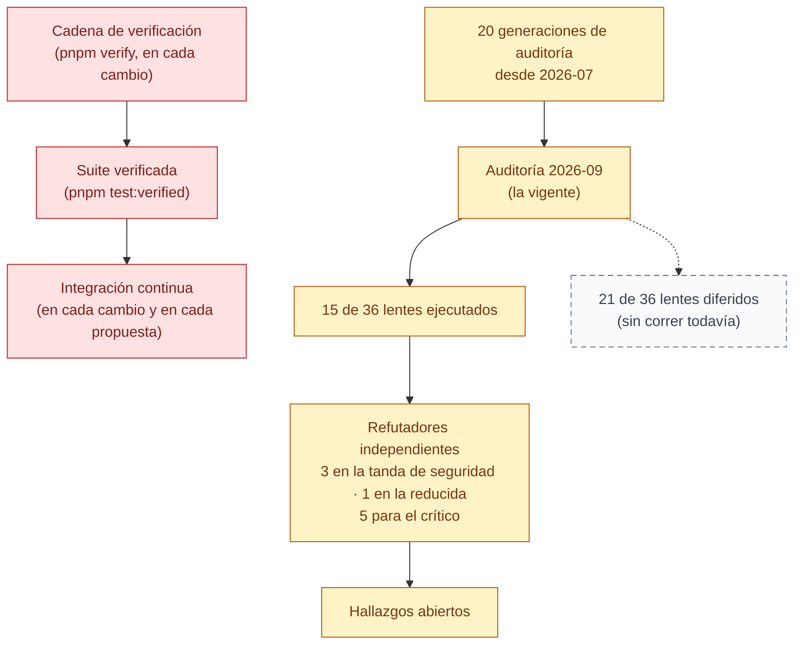

# 12 — Calidad y auditoría

> Snapshot: `c10f4ff03` (`main`) · Facts: `docs/architecture/facts.json` generated 2026-09-02
> Verified against code on 2026-09-02 by writer D (sonnet subagent) · Status: draft
> Numbers in this file are `<!-- fact:key -->` markers checked by `__tests__/architecture-facts.test.ts`.

## Título

Cómo sabemos que funciona

## Mensaje clave

Lo que sostiene la confianza en la plataforma hoy son una cadena de verificación que corre en cada cambio y una auditoría adversarial en curso sobre una porción acotada del sistema — no una certificación externa ni una promesa de cobertura total.

## Nivel

Técnico. Reducción ejecutiva disponible: mostrar solo tres nodos —
"Cadena de verificación" → "Auditoría 2026-09" → "Hallazgos abiertos" —
y leer únicamente el Mensaje clave de arriba.

## Entidades y relaciones

| nodo | etiqueta es-AR | path que lo prueba |
|---|---|---|
| fences | Cadena de verificación | `package.json` (script `verify`) |
| gate | Suite verificada | `scripts/run-verified-suite.ts` |
| ci | Integración continua | `.github/workflows/ci.yml` |
| generaciones | 20 generaciones de auditoría desde 2026-07 | `docs/reviews/README.md` |
| fresh | Auditoría 2026-09 (la vigente) | `docs/reviews/2026-09-fresh/README.md` |
| ejecutados | 15 de 36 lentes ejecutados | `docs/reviews/2026-09-fresh/README.md` |
| diferidos | 21 de 36 lentes diferidos | `docs/reviews/2026-09-fresh/README.md` |
| refutadores | Cada hallazgo pasa por refutadores independientes | `docs/reviews/2026-09-fresh/README.md` |
| backlog | Hallazgos abiertos | `docs/reviews/2026-09-fresh/BACKLOG.md` |

## Mermaid

## Leyenda

- **Rojo (control)** — control automático que corre en cada cambio de código:
  reglas del lenguaje, pruebas y la integración continua. Si falla, el cambio
  no se sube.
- **Ámbar (derivado)** — trabajo de auditoría hecho por agentes leyendo el
  código y refutando sus propios hallazgos. No es un control automático que
  corre solo; es un proceso que se dispara y se lee.
- **Gris punteado (no existe todavía)** — la parte de la auditoría planeada
  que aún no se ejecutó (21 de los 36 lentes). No dibujar esto como si ya
  estuviera cubierto.

## NO dibujar / NO afirmar

- **NO afirmar "100 % testeado" ni "cobertura completa".** 21 de los 36
  lentes planeados de la auditoría 2026-09 están diferidos, sin correr
  todavía. Fuente: `docs/reviews/2026-09-fresh/README.md` (tabla de lentes).
- **NO afirmar "sin bugs" ni "sin hallazgos abiertos".** La auditoría
  vigente tiene 100 hallazgos confirmados; 1 crítico ya se cerró, los otros
  99 siguen abiertos. Fuente: `docs/reviews/2026-09-fresh/README.md` y
  `docs/reviews/2026-09-fresh/BACKLOG.md`.
- **NO afirmar "auditado externamente" ni "certificado".** Las auditorías
  las corren agentes de IA sobre el propio código, con refutación
  adversarial interna — no un tercero independiente ni un organismo
  certificador. Fuente: la naturaleza del proceso descrito en
  `docs/reviews/README.md` (cada generación es un agente leyendo el repo,
  nunca una auditoría contratada externa).
- **NO dibujar hallazgos individuales ni su severidad en esta lámina.** Qué
  se puede afirmar hacia un funcionario ya está separado en un archivo
  propio — no reinterpretar esa lista acá. Fuente:
  `docs/reviews/2026-09-fresh/README.md` ("¿Qué podemos decirle a un
  funcionario?" → `docs/reviews/2026-09-fresh/DECK-FACTS.md`).
- **NO afirmar el puntaje "42/100"** de una auditoría de 2026-07-23 como si
  fuera el estado actual — quedó superado por generaciones posteriores.
  Fuente: `docs/reviews/README.md`, generación 8.

## Confianza

- **Generados (marcadores):** ninguno en esta lámina — los números que
  aparecen (15/36, 21/36, 100, 99, 20 generaciones) son conteos de alcance
  de auditoría, no conteos del repo con clave en `facts.json` (la lista de
  claves disponibles no cubre "cantidad de lentes" ni "cantidad de
  hallazgos"); el brief compartido los trata explícitamente como literales
  válidos ("2 of 36 lenses" es el ejemplo dado).
- **Verificados a mano (path + fecha):** `docs/reviews/README.md`,
  `docs/reviews/2026-09-fresh/README.md` y
  `docs/reviews/2026-09-fresh/BACKLOG.md` existen y fueron leídos el
  2026-09-02 en `c10f4ff03`; `.github/workflows/ci.yml`,
  `scripts/run-verified-suite.ts` y `package.json` (script `verify`) también.
  Los conteos 15/36, 21/36, 20 generaciones, 100 hallazgos confirmados y 99
  abiertos están transcriptos directamente de la tabla y el texto de
  `docs/reviews/2026-09-fresh/README.md` — no recalculados de forma
  independiente por este escritor.
- **No verificado:** si el trabajo nocturno de recorridos de navegador
  (`.github/workflows/e2e-nightly.yml`) es hoy confiable en la práctica —las
  costuras entre navegador real y llamada de programación, la disciplina de
  limpieza— es una pregunta abierta: el lente C09 ("e2e practice") que la
  respondería está DIFERIDO, no corrido. Este archivo no afirma que esa
  compuerta sea sólida; ver `docs/architecture/quality-pipeline.md` §5
  para el detalle técnico.
