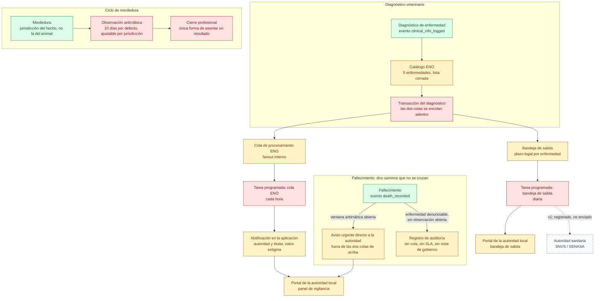

# 13 — Vigilancia epidemiológica y zoonosis

> Snapshot: `4459e670d` (`deck/vigilancia`) · Sin marcadores `fact:` — ninguna de las
> claves numéricas de este archivo existe hoy en `docs/architecture/facts.json`.
> Cada número lleva en cambio "Verificado a mano el 2026-09-09 en `archivo:línea`".
> Verified against code on 2026-09-09 by writer de documentación (Claude, agente de docs).
> Status: draft — falta la reducción ejecutiva de cinco nodos y la revisión adversarial
> de contexto fresco que pasaron los doce specs originales.

## Título

Vigilancia epidemiológica y zoonosis: la señal a la autoridad, sin maquillarla

## Mensaje clave

La señal a la autoridad sanitaria existe, es honesta sobre lo que todavía no hace, y
el ciclo legal completo —plazo por enfermedad, jurisdicción del hecho, ventana de
observación, quién tiene permitido cerrarla— está escrito en el código y corre todos
los días, no en un PDF de procedimientos que nadie audita.

## Nivel

`técnico`. Esta lámina no tiene todavía una reducción ejecutiva de cinco nodos: si el
guion pide una, es un pendiente de diseño (ver nota en `00-guion.md`), no algo que ya
exista acá.

## Entidades y relaciones

| nodo | etiqueta es-AR | path que lo prueba |
|---|---|---|
| DIAGNOSTICO | Diagnóstico de enfermedad | `src/modules/events/application/clinical/record-disease-diagnosis-use-case.ts:132-146` |
| CATALOGO_ENO | Catálogo ENO | `src/modules/surveillance/domain/eno-catalog.ts:33-74` |
| TX | Transacción del diagnóstico | `src/modules/events/application/clinical/record-disease-diagnosis-use-case.ts:150-178` |
| ENOCOLA | Cola de procesamiento ENO | `db/schema.ts:4043-4065` |
| OUTBOX | Bandeja de salida | `db/schema.ts:4453-4497` |
| CRONENO | Tarea programada: cola ENO | `app/api/cron/process-eno-queue/route.ts` |
| CRONOUTBOX | Tarea programada: bandeja de salida | `app/api/cron/drain-outbox/route.ts` |
| FANOUT | Notificación en la aplicación | `src/modules/surveillance/application/process-eno-queue-batch.ts:9-16` |
| VISTAVIG | Portal de la autoridad local · panel de vigilancia | `app/gob/vigilancia/page.tsx` |
| VISTAOUTBOX | Portal de la autoridad local · bandeja de salida | `app/gob/outbox/page.tsx` |
| AUTORIDAD | Autoridad sanitaria (SNVS / SENASA) | `lib/infra/outbox-drainer.ts:56-101` |
| MORDEDURA | Mordedura | `src/modules/surveillance/application/report-bite.ts:152-153` |
| VENTANA | Observación antirrábica | `src/modules/surveillance/domain/rabies-observation.ts:17` |
| CIERRE | Cierre profesional | `src/modules/surveillance/domain/rabies-observation.ts:88-95` |
| FALLECIMIENTO | Fallecimiento | `src/modules/events/application/lifecycle/death-record-use-case.ts:223-239` |
| MUERTEOBS | Aviso urgente directo a la autoridad | `src/modules/events/application/lifecycle/death-record-use-case.ts:495-534` |
| AUDITSOLA | Registro de auditoría | `lib/domain/authority.ts:73-127` |

### Las cinco enfermedades del catálogo ENO

Lista cerrada por decisión de producto (ENO-D1, 2026-05-21) — verificado a mano el
2026-09-09 en `src/modules/surveillance/domain/eno-catalog.ts:33-74`. Agregar una
enfermedad exige tocar el spec, no el catálogo suelto.

| Enfermedad | Severidad | Plazo legal | ¿Estigmatizante? | Anclaje legal |
|---|---|---|---|---|
| Rabia | crítica | 24 h | no | Ley 22.953 (control de rabia) |
| Leptospirosis | alta | 48 h | no | Ley 15.465 (ENO nacional) + Decreto 1088/2011 |
| Hidatidosis / Equinococosis | alta | 48 h | no | Res. SENASA 422/2003 (Anexo II) + Decreto 1088/2011 |
| Brucelosis canina | alta | 72 h | **sí** | Res. SENASA 422/2003 (Anexo II) |
| Leishmaniasis visceral canina | crítica | 48 h | **sí** | Res. SENASA 422/2003 (Anexo II) |

"Estigmatizante" (`stigmaSensitive`) es un campo del propio catálogo: cuando es
verdadero, la Cola de procesamiento ENO **no** avisa al titular — el o la
veterinaria comunica el diagnóstico directamente para preservar un contexto clínico
sensible (`eno-catalog.ts:23-28`). El plazo legal (`notifyHours`) es hoy un número
fijo por enfermedad en este catálogo — **no** se ajusta por jurisdicción, a
diferencia de la ventana de observación antirrábica de más abajo. Ver "Lo que NO se
afirma".

## Mermaid

## Leyenda

- **Verde (fuente de verdad)**: los tres asientos del historial que arrancan todo lo
  demás — el diagnóstico, la mordedura y el fallecimiento. Cada uno es un asiento del
  historial de la mascota, de solo agregado, igual que en la lámina 9.
- **Rojo (control)**: la transacción que encola las dos colas de manera atómica, las
  dos tareas programadas que las drenan, la ventana de observación y el cierre
  profesional que es la única puerta para resolverla.
- **Ámbar (derivado)**: las dos colas, el aviso interno, las dos pantallas del portal
  de la autoridad local, el aviso urgente por muerte en observación y el registro de
  auditoría de una muerte sin observación abierta. Son copias operativas o vistas
  calculadas, no el hecho mismo.
- **Gris punteado (hoy no existe)**: la entrega a la autoridad sanitaria externa. La
  bandeja de salida existe, la SLA existe, el registro de auditoría de "esto se
  hubiera enviado" existe — el receptor del otro lado, no.
- **Sin color**: ninguno en esta lámina.
- **Dos subgrafos separados sin flecha entre sí (Diagnóstico y Fallecimiento)**: es
  deliberado. Un fallecimiento **no** entra a ninguna de las dos colas de arriba,
  salvo por el único camino que sale directo del subgrafo de muerte hacia el panel de
  vigilancia. Dibujarlos conectados sería la mentira más cara de esta lámina.

## NO dibujar / NO afirmar

- **NO afirmar que la bandeja de salida notifica a SENASA o al SNVS.** Genera la
  fila, calcula el plazo legal, la audita — no la envía. `deliverOutboxRow` escribe
  un `audit_log` documentando qué se **hubiera** mandado
  (`lib/infra/outbox-drainer.ts:56-101`), y el propio producto ya lo dice sin
  eufemismos en tres pantallas: *"La notificación obligatoria a SNVS/SENASA/zoonosis
  (Ley 15.465/60, Decreto 3640/64) no está integrada en esta versión"*
  (`app/gob/vigilancia/investigaciones/page.tsx:103`,
  `investigaciones/[caseCode]/page.tsx:134`, `investigaciones/nuevo/page.tsx:41`). No
  hay flecha llena entre la Tarea programada de la bandeja de salida y la Autoridad
  sanitaria: es punteada y dice "v1: registrado, no enviado", sin excepción.
- **NO afirmar que un fallecimiento por enfermedad denunciable siempre avisa a la
  autoridad.** `death_recorded` no está en `OUTBOX_RULES`
  (`lib/events/event-outbox-rules.ts:111-114`, que solo lista
  `clinical_info_logged` y `outbreak_signal`) y el escritor de fallecimiento nunca
  llama a `enqueueEnoTrigger`. Lo único que deja una muerte reportable **sin**
  observación antirrábica abierta es un asiento de auditoría separado
  (`signalAuthorityReport`, `lib/domain/authority.ts:73-127`) — mismo patrón honesto
  "v1_noop" que la bandeja de salida, pero **otro mecanismo**, sin fila en
  `event_notification_outbox`, sin plazo legal (`slaDueAt`), y sin aparecer en
  ninguna de las dos pantallas de gobierno. Verificado a mano el 2026-09-09 en
  `src/modules/events/application/lifecycle/death-record-use-case.ts:473-492`. El
  único aviso **visible en la aplicación** por un fallecimiento sale de una condición
  distinta: que la observación antirrábica estuviera abierta en ese momento
  (`death-record-use-case.ts:495-534`) — y ese aviso tampoco pasa por ninguna de las
  dos colas de arriba, es una notificación urgente directa.
- **NO afirmar que el plazo legal de notificación es ajustable por jurisdicción.**
  `notifyHours` es un número fijo por enfermedad dentro del catálogo ENO
  (`eno-catalog.ts:33-74`), sin lectura de `govtBusinessRules`. Contraste directo con
  la ventana de observación antirrábica, que sí se resuelve por jurisdicción
  (`lib/infra/business-rules-resolver.ts:76-98` sobre la regla declarada en
  `lib/domain/rule-types-registry.ts:173-182`). Un funcionario de una jurisdicción
  con una ordenanza propia de plazos ENO no puede configurarla hoy.
- **NO decir "diez días" sin calificar.** Es el default nacional
  (`RABIES_OBSERVATION_DAYS = 10`, `rabies-observation.ts:17`, Decreto 4669/1973
  PBA + Ordenanza CABA 41.831/1987), pero la ventana efectivamente aplicada a una
  mordedura concreta se resuelve por jurisdicción y queda fotografiada en el propio
  asiento (`observation_days`, `rabies-observation.ts:159-178`) para que nadie la
  vuelva a inventar después. Nunca citar "10 días" como si fuera universal.
- **NO decir que el sistema puede cerrar solo una observación con un resultado
  clínico.** Desde el 2026-08-17 solo un cierre profesional puede asentar un
  resultado (`PROFESSIONAL_OUTCOMES`, `rabies-observation.ts:87-95`); si la ventana
  vence sin que nadie competente cierre, el estado pasa a
  `window_expired_unclosed` — un hecho sobre el proceso, no una conclusión clínica
  (`rabies-observation.ts:40-68`).
- **NO dibujar la jurisdicción de una mordedura como la del domicilio del animal.**
  Desde el commit `4459e670d` (2026-09-09) el caso rutea sobre la jurisdicción del
  hecho y cae a la del animal solo cuando no se la dan
  (`report-bite.ts:152-153`). Una mordedura en Córdoba de una mascota registrada en
  CABA es de la autoridad de Córdoba.
- **NO afirmar que existe un preset "ENO" en la bandeja de salida ni un rol de
  autoridad nacional de solo lectura.** Un escritor hermano está trabajando en
  ambos el 2026-09-09; no aparecen en este snapshot del código
  (`app/gob/outbox`, `lib/infra/outbox-query.ts`, `db/schema.ts` — sin resultados al
  buscar "NATIONAL" ni un preset ENO). Si el mazo se presenta antes de que se
  confirme el envío, decir "en curso" y nada más.
- **NO poner "DIM" en ninguna etiqueta.** La marca en pantalla es miMAR.

## Confianza

**No hay marcadores `fact:` en esta lámina.** Ninguna de las claves usadas acá existe
todavía en `docs/architecture/facts.json`; cada número de esta ficha lleva su propia
cita de archivo y línea en vez de un marcador con control automático.

**Verificado a mano contra el código el 2026-09-09, sobre `4459e670d`:**
- el catálogo cerrado de 5 enfermedades, con severidad, plazo y sensibilidad al
  estigma (`src/modules/surveillance/domain/eno-catalog.ts:33-74`);
- las dos tablas, `eno_processing_queue` (`db/schema.ts:4043-4065`) y
  `event_notification_outbox` (`db/schema.ts:4453-4497`) — el enum de destino de la
  segunda declara cuatro valores (`govt_webhook`, `eno_authority`, `audit_export`,
  `internal_dashboard`, `db/schema.ts:4441-4448`) pero **solo `govt_webhook` tiene
  hoy una regla que lo produzca** (`lib/events/event-outbox-rules.ts:72-114`);
- que las dos colas se encolan dentro de la misma transacción que el asiento clínico
  (`record-disease-diagnosis-use-case.ts:150-178`), y que la cola ENO nunca se llama
  desde el escritor de fallecimiento (`enqueueEnoTrigger` solo tiene dos llamadores:
  el diagnóstico y el síntoma observado — `writers.ts:36-48`,
  `symptom-observed-use-case.ts`);
- el reparto horario de la cola ENO (`app/api/cron/process-eno-queue/route.ts`) y el
  drenaje diario de la bandeja de salida vía el despachador único
  (`app/api/cron/drain-outbox/route.ts:18-19`);
- la entrega v1 como no-operación auditada, en los dos mecanismos por separado —
  `lib/infra/outbox-drainer.ts:56-101` (bandeja de salida) y
  `lib/domain/authority.ts:73-127` (`signalAuthorityReport`, la vía de un
  fallecimiento sin observación abierta) —, cada uno con su propia fila de
  `audit_log` y su propio marcador `v1_noop: true`, sin compartir cola;
  `signalAuthorityReport` **no** inserta en `event_notification_outbox`;
- el aviso urgente directo a la autoridad cuando un fallecimiento cierra una
  observación antirrábica en curso, y que ese aviso **no** pasa por
  `eno_processing_queue` ni por `event_notification_outbox`
  (`death-record-use-case.ts:495-534`);
- que la jurisdicción de una mordedura es la del hecho, con caída a la del animal
  solo si no se la da el formulario (`report-bite.ts:152-153`, commit `4459e670d`);
- que la ventana de observación antirrábica se resuelve por jurisdicción
  (`business-rules-resolver.ts:76-98`, `rule-types-registry.ts:173-182`) mientras el
  plazo legal ENO no lo hace (`eno-catalog.ts`, sin lectura de reglas de negocio);
  que solo un cierre profesional asienta un resultado clínico
  (`rabies-observation.ts:87-95`) y que la propia aplicación ya usa el término "ENO"
  con su definición y advierte sin envío externo desde tres pantallas de vigilancia
  (`components/ui/GlossaryTerm.tsx`;
  `app/gob/vigilancia/investigaciones/page.tsx:102-104`;
  `investigaciones/[caseCode]/page.tsx:133-135`; `investigaciones/nuevo/page.tsx:40-42`).

**No verificado — dejado así a propósito:**
- **El dato de la base viva** (31 filas en la bandeja de salida, 7 apuntando a un
  evento existente, ninguna de ellas un diagnóstico) fue medido en la base viva el
  9/9 por quien encargó esta lámina, no por este archivo: no ejecuté ninguna consulta
  contra la base para producirlo. No hay hoy ningún diagnóstico veterinario
  verificado en el entorno vivo — el mazo no puede simular que existe uno de
  demostración.
- **El preset "ENO" en `/gob/outbox` y un rol de autoridad nacional de solo
  lectura.** Reportados como trabajo en curso el 2026-09-09 por un escritor hermano;
  no están en este snapshot del código. No confirmable desde el repositorio a esta
  fecha.
- **Que la cadena de verificación (`pnpm verify` / `pnpm test:verified`) cubre este
  módulo.** No corrí ningún comando: esta lámina es investigación de código, no
  ejecución. Los tests existentes que sí vi de pasada
  (`record-disease-diagnosis-use-case.test.ts`,
  `professional-close-observation.test.ts`, `death-record-use-case.test.ts`)
  sugieren cobertura, pero "sugiere" no es "verifiqué que pasan".
