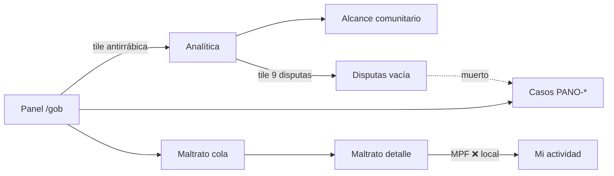

# Validación MiMAR — Deep Pass A: Journey de valor del operador

**Agente:** Cursor (browser automation + code trace)  
**Fecha:** 2026-07-06  
**Entorno:** `http://localhost:3000` — seed local  
**Cuenta:** `govt@dim.test` / `Test1234!` — scope 3 localidades (CABA, Santa Cruz/El Calafate, Tierra del Fuego/Ushuaia)

**Criterio:** no validar que los números coinciden — validar que un funcionario **llega a decidir** sin adivinar. Pregunta rectora por pantalla: *¿un director de Zoonosis toma una decisión con esto?*

Screenshots: sesión browser (`panorama-kpi-42.png` en temp Cursor); reutilizar `docs/reviews/results/val-2-govt-screenshots/` para panel/perdidas previos.

---

## Veredicto ejecutivo

| Loop | ¿Cierra alerta→acción→constancia? | Severidad |
|------|-----------------------------------|-----------|
| **Sanitaria** (antirrábica 42% bajo meta) | **Parcial** — alarm tile → Analítica/Panorama/Outreach sí; acción de campaña vacía (Campañas sin datos) | MAYOR |
| **Bienestar** (90 denuncias activas) | **Sí, con fricción** — Panel → Maltrato → detalle con triage/asignar/cerrar/derivar; constancia en Historial; MPF falló en local | MAYOR (constancia MPF) |
| **Regulatorio** (casos PANO-CASE-HIST-*) | **No** — lectura + normativa; sin cerrar/resolver en UI | MAYOR |
| **Pérdidas** (6 activas) | **Parcial** — lista operativa pero **sin CAS-** ni drill a expediente | MAYOR |

**VERDICT global: CONDITIONAL PASS** — el operador puede trabajar denuncias y outreach; los expedientes regulatorios y la constancia fiscal quedan rotos o incompletos.

---

## (1) Loop real alerta → acción → constancia

### A · Cobertura antirrábica (alarma Panel)

| Paso | Qué hizo el operador | Resultado | ¿Sin adivinar? |
|------|----------------------|-----------|----------------|
| 1 | Panel `/gob` → tile **Atención: Cobertura antirrábica 42%** | Navega a `/gob/analytics` | ✅ enlace explícito |
| 2 | Analítica → tile disputas / explorar outreach | KPIs + rankings; **Exportar CSV →** lleva a `/gob/analytics/export` | ✅ |
| 3 | Acción de remediación | `/gob/outreach` lista **500+ mascotas con antirrábica vencida** + **Exportar CSV** | ✅ herramienta de decisión |
| 4 | Campaña masiva | `/gob/campanas` → *"No hay campañas en tu cobertura"* | ❌ callejón sin señalización desde Panel |
| 5 | Constancia | CSV analytics + audit `pii_queried` en `/gob/historial` | ✅ parcial |

**Pregunta clave:** *¿Con 42% bajo meta 80%, el director sabe qué hacer mañana?*  
**Respuesta:** Sí vía **Alcance comunitario** (lista + CSV). No desde **Campañas** (vacía). El Panel no dice "ir a Outreach" — hay que inferir o conocer el producto.

### B · Denuncias ciudadanas (widget Panel 90 activas)

| Paso | Qué hizo el operador | Resultado | ¿Sin adivinar? |
|------|----------------------|-----------|----------------|
| 1 | Panel → sección **Denuncias ciudadanas · 90** | Contador visible; enlace implícito vía nav **Maltrato** (no CTA "Ver bandeja" en snapshot a11y del widget inferior) | ⚠️ |
| 2 | `/gob/maltrato` | Cola 113 filas, severidad + DEN-XXXX | ✅ |
| 3 | Abrir caso | URL directa `/gob/maltrato/{uuid}` (fila es `<Link>` pero **no aparece como link en árbol a11y** — riesgo descubribilidad) | ⚠️ |
| 4 | Accionar | Botones visibles: **Asignármela**, **Marcar revisada**, **Iniciar seguimiento**, **Cerrar con resolución**, **Sin sustento**, **Duplicada**, **Derivar a org**, **Iniciar decomiso →** | ✅ |
| 5 | Constancia fiscal | **Generar PDF MPF** → spinner → *"Error al subir el PDF. Verificá la conectividad con el servidor."* (Storage local) | ❌ |
| 6 | Constancia operativa | `/gob/historial` registra consultas PII, ubicación de caso, outreach | ✅ |

**Pregunta clave:** *¿Puede el fiscal de bienestar cerrar el circuito hasta MPF?*  
**Respuesta:** La UI promete el circuito; en este entorno **la constancia MPF falla** (upload). Triage/asignación sí están en pantalla.

### C · Disputas de custodia (alarma Analítica)

| Paso | Resultado |
|------|-----------|
| Tile Analítica **"Disputas de custodia · 9 casos abiertos"** | Cuenta casos en tabla `cases` |
| `/gob/disputas` | **"No hay disputas"** — consulta `custody_disputes` (tabla distinta) |
| `/gob/casos` | 34 expedientes **PANO-CASE-HIST-*** con links |
| Detalle `PANO-CASE-HIST-DIS-000023` | Solo lectura: partes, normativa, mapa; **sin botones de resolución** |

**Pregunta clave:** *¿El operador resuelve la disputa desde la alarma?*  
**Respuesta:** **No.** La alarma y la cola apuntan a sistemas distintos; el detalle no permite decidir.

### D · Export CSV Analítica

| Paso | Resultado |
|------|-----------|
| `/gob/analytics` → **Exportar CSV →** | Llega a wizard `/gob/analytics/export` |
| Wizard | Período, jurisdicción, datasets (Mascotas ✓, Eventos/Casos/Orgs), formato CSV/JSON, botón **Generar export** |

**Pregunta clave:** *¿Hay constancia analítica sin salir del shell?*  
**Respuesta:** **Sí** — flujo explícito, no hace falta adivinar URL.

---

## (2) Superficies no tocadas en Pass 2 — rubric decisión vs tile

Leyenda: **🟢 Decisión** · **🟡 Diagnóstico** (informa, no actúa) · **🔴 Decorativo / muerto** · **⚪ Vacío seed**

| Superficie | Ruta | Rubric | ¿Director decide? | Notas |
|------------|------|--------|-------------------|-------|
| **Programa** | `/gob/programa` | 🟡+🟢 | Parcial | KPIs North-Star + calidad de datos + **formulario crear suscripción** (alertas). Sin cola de aprobaciones pendiente. |
| **Campañas** | `/gob/campanas` | ⚪ | No | Empty state educativo; sin campañas seed → no hay decisión de inscripción/completitud. |
| **Alcance comunitario** | `/gob/outreach` | 🟢 | **Sí** | 3 pipelines; lista operativa PII; **Exportar CSV**; audit automático. Mejor superficie de acción sanitaria. |
| **Población** | `/gob/poblacion` | 🟡 | Parcial | Balance altas/nacimientos/muertes + gráfico esterilización vacío. Orienta política, no ejecuta. |
| **Censo** | `/gob/censo` | 🟡 | Parcial | Embudo chip/ISO/escaneos — útil para priorizar identificación; sin CTA a outreach. |
| **Decomisos** | `/gob/decomisos` | 🔴 | No | *"Tu usuario no está asociado a ninguna autoridad sanitaria"* — `govt@` sin org `sanitary_authority`. |
| **Disputas** | `/gob/disputas` | 🔴 | No | Vacía pese a 9 casos en Analítica/Casos — **desalineación de fuentes**. |
| **Organizaciones** | `/gob/organizaciones` | 🟢 (gated) | Parcial | Requiere búsqueda activa; sin query = pantalla vacía. |
| **Usuarios** | `/gob/usuarios` | 🟢 | Sí | Lista + **Proponer vet** por fila; búsquedas auditadas. |
| **Servicios** | `/gob/servicios` | ⚪ | No | Cola de revisión vacía. |
| **Mi actividad** | `/gob/historial` | 🟢 | Sí (constancia) | Audit log agrupado; prueba de acciones previas (outreach, ubicación caso). |

### Preguntas clave (una línea cada una)

- **Programa:** ¿Configuro alertas que me despierten cuando la cobertura cae? → Sí, formulario de suscripción; no hay alertas activas seed.
- **Campañas:** ¿Lanzo o mido una campaña de vacunación? → No hay datos; tile inútil hoy.
- **Outreach:** ¿A quién llamo mañana por antirrábica vencida? → **Sí**, lista + CSV.
- **Población/Censo:** ¿Dónde está el agujero del registro? → Informan; no ejecutan contacto.
- **Decomisos:** ¿Inicio o reasigno un decomiso? → **Bloqueado** para esta cuenta seed.
- **Disputas:** ¿Resuelvo custodia? → **No** (lista vacía + detalle casos sin acciones).
- **Organizaciones/Usuarios:** ¿Habilito o verifico actores? → Usuarios sí; orgs solo tras buscar.
- **Servicios:** ¿Apruebo oferta de servicio? → Cola vacía.
- **Mi actividad:** ¿Puedo rendir cuentas de lo que hice? → **Sí**.

---

## (3) Drill-downs obligatorios

### 3a · CAS- desde `/gob/perdidas`

| Esperado (PO) | Observado |
|---------------|-----------|
| Fila con **CAS-XXXX-XXXX** clickeable → `/gob/casos/{code}` | **No hay CAS- en ninguna fila.** Solo nombre mascota + **Ver credencial** (`/p/{token}`) |
| Código en UI | `LostPetRow` soporta `caseCode` opcional (`app/gob/perdidas/_components/LostPetRow.tsx`) |
| Datos | Query local: **0 filas** `cases.case_kind='lost_pet_episode'` — el seed no materializa episodios perdidos como casos CAS- |

**Severidad: MAYOR** — el drill-down está implementado pero **no hay datos**; el operador no puede abrir expediente de pérdida desde la cola. Los casos visibles usan prefijo **PANO-CASE-HIST-** (histórico demo), no **CAS-**.

**Pregunta clave:** *¿Desde Pérdidas llego al expediente CAS- sin buscar en Casos?* → **No.**

### 3b · Editar regla en `/gob/reglas`

| Esperado | Observado |
|----------|-----------|
| Editar umbral/meta jurisdiccional | **Vista de solo lectura** para gobierno: *"La administración de reglas la hace el admin nacional."* |
| Contenido | 3 bloques (CABA, El Calafate, Ushuaia) con defaults nacionales (PPP, ventana antirrábica 10d, etc.) |

Ruta de edición existe en código (`/gob/reglas/.../editar/[ruleId]`) pero **govt no tiene affordance de edición** en `/gob/reglas`.

**Severidad: MENOR** (by design) — un director **consulta** reglas, no las cambia. Si el test asumía edición gobierno, es gap de expectativa, no bug.

**Pregunta clave:** *¿El gobierno local ajusta la meta 80% desde acá?* → **No** (solo admin).

### 3c · Franja KPI inferior Panorama (42%)

| Esperado | Observado |
|----------|-----------|
| Misma fuente que Panel (`fetchRabiesCoverage` / `getPanoramaKpis`) | **42%** visible en franja inferior tras scroll |
| Tile | **Atención: Cobertura antirrábica (perros, 12m) · 42% · meta 80% · 3 partidos** |
| Coherencia narrativa | Subtítulo superior: *"cobertura actual 42%"*; nota *"Consistente con las superficies de detalle"* |

**Severidad: OK** — el 42% inferido por código en Pass 2 queda **confirmado visualmente** en la franja KPI (no solo en Panel).

**Pregunta clave:** *¿El mapa y los KPIs del Panorama cuentan la misma historia que el Panel?* → **Sí** para antirrábica 42%.

---

## Hallazgos por severidad

### MAYOR

1. **MPF export falla en local** — `Generar PDF MPF` → error de subida Storage. Rompe *alerta→acción→constancia* en bienestar fiscal. Área: `MpfExportButton.tsx` + bucket Supabase.
2. **Disputas: alarma 9 vs cola vacía** — Analítica cuenta `cases`; `/gob/disputas` lee `custody_disputes`. El operador que sigue la alarma llega a callejón. Área: alinear contador o redirigir a `/gob/casos?kind=…`.
3. **Casos regulatorios sin acciones** — detalle disputa/decomiso histórico es dossier read-only; no cerrar, asignar ni resolver. Área: `app/gob/casos/[publicCode]/`.
4. **Pérdidas sin CAS-** — seed no crea `lost_pet_episode`; UI preparada pero inerte. Área: seed + `fetchLostEpisodeCaseCodesForPets`.
5. **Decomisos inaccesible para govt@** — falta org `sanitary_authority` en seed del operador. Área: bootstrap seed govt.

### MENOR

1. **Maltrato cola: filas no expuestas como links en a11y** — `<Link>` existe en código pero snapshot lista `<li>` sin rol link; dificulta automatización y lectores de pantalla.
2. **Panel → denuncias** — widget inferior muestra contador; CTA "Ver bandeja" no apareció en árbol a11y del panel recargado (nav Maltrato sigue siendo ruta obvia).
3. **Campañas vacías** — copy ayuda, pero desde Panel no hay puente a Outreach cuando la acción sanitaria es contacto, no campaña programada.
4. **Abreviaturas zoonosis** — `lepto`/`hidat` en tiles (ya reportado Pass 2).

### OK / Fortalezas

1. **Maltrato detalle** — triage completo, derivación org/decomiso, mapa con ubicación exacta auditada.
2. **Outreach** — mejor cadena "dato → lista → CSV → audit".
3. **Analytics export wizard** — constancia analítica explícita.
4. **Panorama KPI strip** — 42% alineado con Panel; capas + presets orientan *dónde* mirar.
5. **Historial** — cierra constancia operativa (incluye esta sesión de validación).

---

## Mapa de navegación inferido vs explícito

---

## Respuesta a la pregunta del PO

> ¿Se puede cerrar el círculo "alerta→acción→constancia" sin adivinar?

| Dominio | Respuesta |
|---------|-----------|
| Vacunación / cobertura | **Casi** — falta señal Panel→Outreach; Campañas no ayuda |
| Denuncias bienestar | **Sí en acción, no en MPF** — triage claro; PDF fiscal roto local |
| Expedientes regulatorios | **No** — lectura sin cierre |
| Pérdidas | **No** — sin CAS- ni expediente |

---

## Próximos pasos sugeridos (para Ignacio / backlog)

1. Seed: `lost_pet_episode` cases con `CAS-*` para mascotas perdidas seed + org sanitaria para `govt@`.
2. Unificar disputas: un solo contador y un solo destino de cola.
3. Acciones de resolución en `/gob/casos/[code]` o redirigir disputas históricas a flujo activo.
4. Verificar bucket Storage para MPF en `qa-up` checklist.
5. Panel: CTA explícito "Contactar vencidos →" hacia `/gob/outreach` cuando antirrábica < meta.

---

*Deep Pass A completado 2026-07-06 · cuenta govt@dim.test · sin validación numérica cruzada (explícitamente excluida).*
